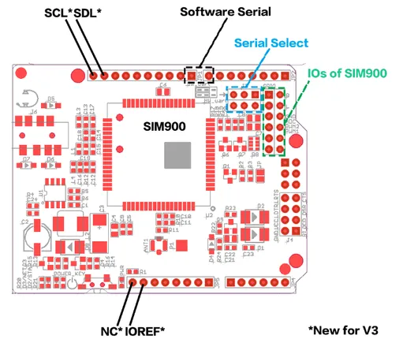

# GPRS Shield V3.0

**Seeed Studio** · Source collection

Revision: Unverified source identity  
Coverage: Source collection; review pending

[Browse all manufacturers](../../../../BROWSE.md) · [Desktop app](https://github.com/valleytechsolutions/black-wire-desktop)

## Hardware Overview

**source reference** · Unreviewed source · PNG

[Open original reference](../../../../library/media/3b138e6642a72d5726fcd8fb5cf55d16e57cc18c49c85f997502efbd575b8e1f.png)

**Credit and rights:** Source rights not yet established. Source/manufacturer: Seeed Studio.

[Source 1](https://files.seeedstudio.com/wiki/GPRS_Shield_V3.0/img/Gprs_shield_v3_layout1.png) · [Source 2](https://wiki.seeedstudio.com/GPRS_Shield_V3.0/)

Original source index: Hardware Overview. This file is searchable but has not been promoted to a reviewed physical board pinout.

SHA-256: `3b138e6642a72d5726fcd8fb5cf55d16e57cc18c49c85f997502efbd575b8e1f`

Pin assignments have not been independently electrically verified. Check board revision before wiring.
