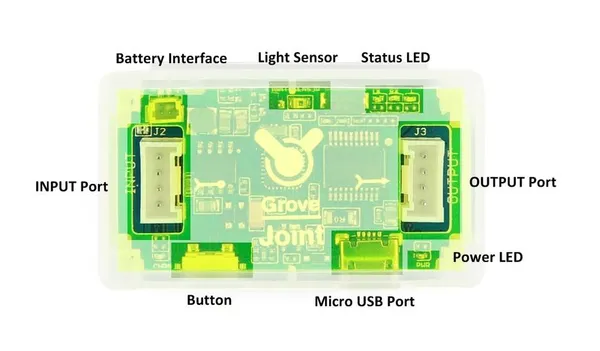

# Grove - Joint V2.0

**Seeed Studio** · Source collection

Revision: Unverified source identity  
Coverage: Source collection; review pending

[Browse all manufacturers](../../../../BROWSE.md) · [Desktop app](https://github.com/valleytechsolutions/black-wire-desktop)

## Joint V2.0 - Hardware Overview

**source reference** · Unreviewed source · JPG

[Open original reference](../../../../library/media/6cffb5c8fa1f429e9fe1cf7670e54834360d62335daa5a3a991b8ba94c14d222.jpg)

**Credit and rights:** Source rights not yet established. Source/manufacturer: Seeed Studio.

[Source 1](https://files.seeedstudio.com/wiki/Grove-Joint_v2.0/img/Grove-Joint_instruction1_.jpg) · [Source 2](https://wiki.seeedstudio.com/Grove-Joint_v2.0/)

Original source index: Joint V2.0 - Hardware Overview. This file is searchable but has not been promoted to a reviewed physical board pinout.

SHA-256: `6cffb5c8fa1f429e9fe1cf7670e54834360d62335daa5a3a991b8ba94c14d222`

Pin assignments have not been independently electrically verified. Check board revision before wiring.
