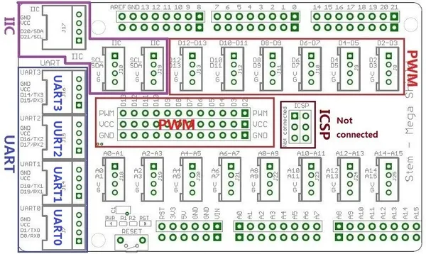

# Grove - Mega Shield

**Seeed Studio** · Source collection

Revision: Unverified source identity  
Coverage: Source collection; review pending

[Browse all manufacturers](../../../../BROWSE.md) · [Desktop app](https://github.com/valleytechsolutions/black-wire-desktop)

## Mega Shield - Hardware Overview

**source reference** · Unreviewed source · JPG

[Open original reference](../../../../library/media/96a5222a4245be4cff0a59b345d85380a08bef8279d4a257cf8b4fa3de216a90.jpg)

**Credit and rights:** Source rights not yet established. Source/manufacturer: Seeed Studio.

[Source 1](https://files.seeedstudio.com/wiki/Grove-Mega_Shield/img/Megashield001.jpg) · [Source 2](https://wiki.seeedstudio.com/Grove-Mega_Shield/)

Original source index: Mega Shield - Hardware Overview. This file is searchable but has not been promoted to a reviewed physical board pinout.

SHA-256: `96a5222a4245be4cff0a59b345d85380a08bef8279d4a257cf8b4fa3de216a90`

## Mega Shield - Pin Functions (UART)

**source reference** · Unreviewed source · JPG

[Open original reference](../../../../library/media/e91bce396f20f08c63fdc0aa706c2115621bb8e6e47cdf9656b2ae9485a272e8.jpg)

**Credit and rights:** Source rights not yet established. Source/manufacturer: Seeed Studio.

[Source 1](https://files.seeedstudio.com/wiki/Grove-Mega_Shield/img/Megashield002.jpg) · [Source 2](https://wiki.seeedstudio.com/Grove-Mega_Shield/)

Original source index: Mega Shield - Pin Functions (UART). This file is searchable but has not been promoted to a reviewed physical board pinout.

SHA-256: `e91bce396f20f08c63fdc0aa706c2115621bb8e6e47cdf9656b2ae9485a272e8`

Pin assignments have not been independently electrically verified. Check board revision before wiring.
