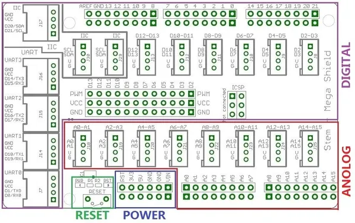
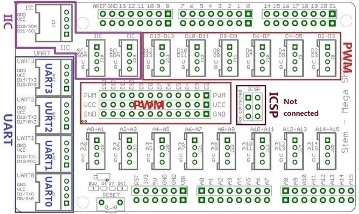

# Grove - Mega Shield

**Seeed Studio** · Source collection

Revision: Unverified source identity

Coverage: Source collection; review pending

[Browse all manufacturers](../../../../BROWSE.md) · [Devices & IoT](../../../../DEVICES.md) · [Open in the browser guide](https://valleytech-black-wire-guide.pages.dev/?board=source-board-a4388d63a62bacb53d)

## Datasheets and original documentation

Board datasheet: **not yet recorded**. Visual reference: **available**.

[Manufacturer source (recorded link)](https://wiki.seeedstudio.com/Grove-Mega_Shield/)

A chip datasheet, schematic and board datasheet have different scopes. Match the exact hardware revision.

[Documentation coverage and remaining gaps](../../../../DOCUMENTATION.md)

## Mega Shield - Hardware Overview

**source reference** · Unreviewed source · JPG

[Open original reference](../../../../library/media/96a5222a4245be4cff0a59b345d85380a08bef8279d4a257cf8b4fa3de216a90.jpg)

**Credit and rights:** Source rights not yet established. Source/manufacturer: Seeed Studio.

[Source 1](https://files.seeedstudio.com/wiki/Grove-Mega_Shield/img/Megashield001.jpg) · [Source 2](https://wiki.seeedstudio.com/Grove-Mega_Shield/)

Original source index: Mega Shield - Hardware Overview. This file is searchable but has not been promoted to a reviewed physical board pinout.

Image revision: Not identified

SHA-256: `96a5222a4245be4cff0a59b345d85380a08bef8279d4a257cf8b4fa3de216a90`

## Mega Shield - Pin Functions (UART)

**source reference** · Unreviewed source · JPG

[Open original reference](../../../../library/media/e91bce396f20f08c63fdc0aa706c2115621bb8e6e47cdf9656b2ae9485a272e8.jpg)

**Credit and rights:** Source rights not yet established. Source/manufacturer: Seeed Studio.

[Source 1](https://files.seeedstudio.com/wiki/Grove-Mega_Shield/img/Megashield002.jpg) · [Source 2](https://wiki.seeedstudio.com/Grove-Mega_Shield/)

Original source index: Mega Shield - Pin Functions (UART). This file is searchable but has not been promoted to a reviewed physical board pinout.

Image revision: Not identified

SHA-256: `e91bce396f20f08c63fdc0aa706c2115621bb8e6e47cdf9656b2ae9485a272e8`

Pin assignments have not been independently electrically verified. Check board revision before wiring.
