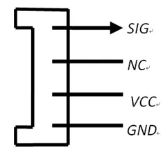

# Grove - Node

**Seeed Studio** · Source collection

Revision: Unverified source identity  
Coverage: Source collection; review pending

[Browse all manufacturers](../../../../BROWSE.md) · [Desktop app](https://github.com/valleytechsolutions/black-wire-desktop)

## Node - Pinout (Grove Connector)

**source reference** · Unreviewed source · PNG

[Open original reference](../../../../library/media/3c087ac662673bb327aaf0c1f1079cb83adea7d11765632810342463c48746a6.png)

**Credit and rights:** Source rights not yet established. Source/manufacturer: Seeed Studio.

[Source 1](https://files.seeedstudio.com/wiki/Grove-Node/img/Mil_Grove_con.png) · [Source 2](https://wiki.seeedstudio.com/Grove-Node/)

Original source index: Node - Pinout (Grove Connector). This file is searchable but has not been promoted to a reviewed physical board pinout.

SHA-256: `3c087ac662673bb327aaf0c1f1079cb83adea7d11765632810342463c48746a6`

Pin assignments have not been independently electrically verified. Check board revision before wiring.
