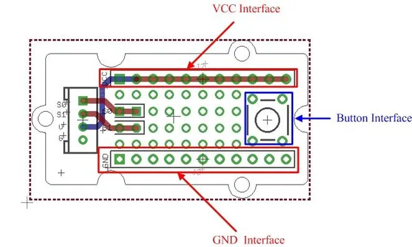

# Grove - Protoshield

**Seeed Studio** · Source collection

Revision: Unverified source identity  
Coverage: Source collection; review pending

[Browse all manufacturers](../../../../BROWSE.md) · [Desktop app](https://github.com/valleytechsolutions/black-wire-desktop)

## Protoshield - Interfaces

**source reference** · Unreviewed source · JPG

[Open original reference](../../../../library/media/6bbcb97115191d56dee4eac947c04a900e723793db26fbecea968bc5e607b59e.jpg)

**Credit and rights:** Source rights not yet established. Source/manufacturer: Seeed Studio.

[Source 1](https://files.seeedstudio.com/wiki/Grove-Protoshield/img/Grove-Protoshield_Interface_1.jpg) · [Source 2](https://wiki.seeedstudio.com/Grove-Protoshield/)

Original source index: Protoshield - Interfaces. This file is searchable but has not been promoted to a reviewed physical board pinout.

SHA-256: `6bbcb97115191d56dee4eac947c04a900e723793db26fbecea968bc5e607b59e`

Pin assignments have not been independently electrically verified. Check board revision before wiring.
