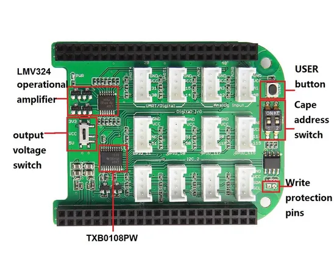

# Grove Base Cape for BeagleBone V2

**Seeed Studio** · Source collection

Revision: Unverified source identity  
Coverage: Source collection; review pending

[Browse all manufacturers](../../../../BROWSE.md) · [Desktop app](https://github.com/valleytechsolutions/black-wire-desktop)

## Hardware Overview

**source reference** · Unreviewed source · JPG

[Open original reference](../../../../library/media/8e507e6ff1c77e57f5018fbf942d438eda25a9ba98bc947dfb66cc6b25f28215.jpg)

**Credit and rights:** Source rights not yet established. Source/manufacturer: Seeed Studio.

[Source 1](https://files.seeedstudio.com/wiki/Grove_Base_Cape_for_BeagleBone_v2/img/Grove_Base_Cape_for_BeagleBone_v2_hardware_overview_1200.jpg) · [Source 2](https://wiki.seeedstudio.com/Grove_Base_Cape_for_BeagleBone_v2/)

Original source index: Hardware Overview. This file is searchable but has not been promoted to a reviewed physical board pinout.

SHA-256: `8e507e6ff1c77e57f5018fbf942d438eda25a9ba98bc947dfb66cc6b25f28215`

Pin assignments have not been independently electrically verified. Check board revision before wiring.
