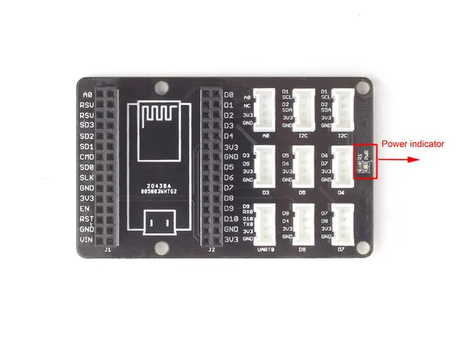

# Grove Base Shield for NodeMCU V1.0

**Seeed Studio** · Source collection

Revision: Unverified source identity  
Coverage: Source collection; review pending

[Browse all manufacturers](../../../../BROWSE.md) · [Desktop app](https://github.com/valleytechsolutions/black-wire-desktop)

## Hardware Overview

**source reference** · Unreviewed source · JPG

[Open original reference](../../../../library/media/201de8992584b4c067eb89f76c5144ddbc02a302a7c793942c2e10921230aca9.jpg)

**Credit and rights:** Source rights not yet established. Source/manufacturer: Seeed Studio.

[Source 1](https://files.seeedstudio.com/wiki/Grove_Base_Shield_for_NodeMCU_V1.0/img/Base_Shield_for_NodeMCU2.jpg) · [Source 2](https://wiki.seeedstudio.com/Grove_Base_Shield_for_NodeMCU_V1.0/)

Original source index: Hardware Overview. This file is searchable but has not been promoted to a reviewed physical board pinout.

SHA-256: `201de8992584b4c067eb89f76c5144ddbc02a302a7c793942c2e10921230aca9`

Pin assignments have not been independently electrically verified. Check board revision before wiring.
