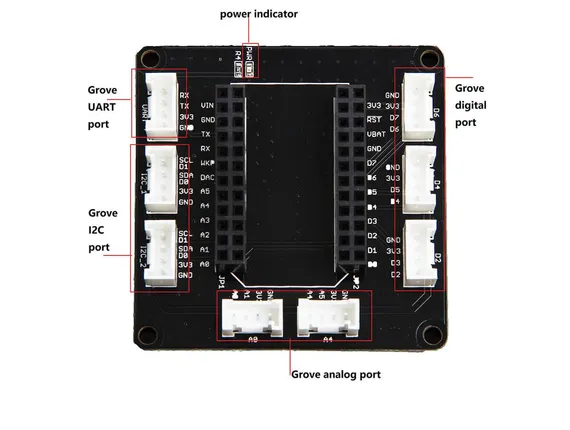

# Grove Base Shield for Photon

**Seeed Studio** · Source collection

Revision: Unverified source identity  
Coverage: Source collection; review pending

[Browse all manufacturers](../../../../BROWSE.md) · [Desktop app](https://github.com/valleytechsolutions/black-wire-desktop)

## Hardware Overview

**source reference** · Unreviewed source · JPG

[Open original reference](../../../../library/media/3e2c5b92909ba68234541778249491ccfa5c32855f0314e4f030a1f98b245002.jpg)

**Credit and rights:** Source rights not yet established. Source/manufacturer: Seeed Studio.

[Source 1](https://files.seeedstudio.com/wiki/Grove_Base_Shield_for_Photon/img/Grove_Base_Shield_for_Photon_component_diagram_annotated_1200_s.jpg) · [Source 2](https://wiki.seeedstudio.com/Grove_Base_Shield_for_Photon/)

Original source index: Hardware Overview. This file is searchable but has not been promoted to a reviewed physical board pinout.

SHA-256: `3e2c5b92909ba68234541778249491ccfa5c32855f0314e4f030a1f98b245002`

Pin assignments have not been independently electrically verified. Check board revision before wiring.
