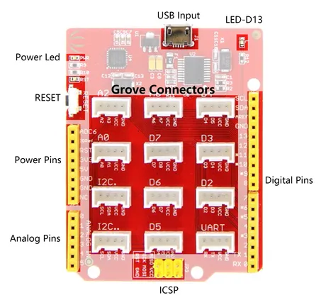

# Grove Beginner Kit for Arduino

**Seeed Studio** · Source collection

Revision: Unverified source identity  
Coverage: Source collection; review pending

[Browse all manufacturers](../../../../BROWSE.md) · [Desktop app](https://github.com/valleytechsolutions/black-wire-desktop)

## Hardware Overview 2

**source reference** · Unreviewed source · PNG

[Open original reference](../../../../library/media/d42de7286f0ce69d281ce25e171aea1c982767fba8498a84dab751be2de00480.png)

**Credit and rights:** Source rights not yet established. Source/manufacturer: Seeed Studio.

[Source 1](https://files.seeedstudio.com/wiki/Grove-Beginner-Kit-For-Arduino/img/1.png) · [Source 2](https://wiki.seeedstudio.com/Grove-Beginner-Kit-For-Arduino/)

Original source index: Hardware Overview 2. This file is searchable but has not been promoted to a reviewed physical board pinout.

SHA-256: `d42de7286f0ce69d281ce25e171aea1c982767fba8498a84dab751be2de00480`

## Hardware Overview

**source reference** · Unreviewed source · PNG

[Open original reference](../../../../library/media/5010087fa26820ffefcf20c91957101a5a95e7d5e9801e7f3e0aad515124b470.png)

**Credit and rights:** Source rights not yet established. Source/manufacturer: Seeed Studio.

[Source 1](https://files.seeedstudio.com/wiki/Grove_Beginner_Kit_for_Arduino/img/pinout.png) · [Source 2](https://wiki.seeedstudio.com/Grove_Beginner_Kit_for_Arduino/)

Original source index: Hardware Overview. This file is searchable but has not been promoted to a reviewed physical board pinout.

SHA-256: `5010087fa26820ffefcf20c91957101a5a95e7d5e9801e7f3e0aad515124b470`

Pin assignments have not been independently electrically verified. Check board revision before wiring.
