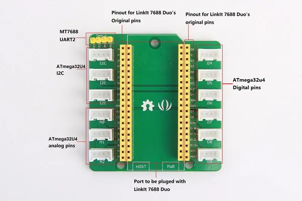

# Grove Breakout for LinkIt Smart 7688 Duo

**Seeed Studio** · Source collection

Revision: Unverified source identity  
Coverage: Source collection; review pending

[Browse all manufacturers](../../../../BROWSE.md) · [Desktop app](https://github.com/valleytechsolutions/black-wire-desktop)

## Hardware Overview

**source reference** · Unreviewed source · JPG

[Open original reference](../../../../library/media/d7c1e05e30a9669d033f65f5dfe7c6670965ac31baa4b42023b568d27cb7c25b.jpg)

**Credit and rights:** Source rights not yet established. Source/manufacturer: Seeed Studio.

[Source 1](https://files.seeedstudio.com/wiki/Grove-Breakout_for_LinkIt_Smart_7688_Duo/img/Grove_Breakout_for_LinkIt_Smart_7688_Duo_component_with_text_1200_s.jpg) · [Source 2](https://wiki.seeedstudio.com/Grove_Breakout_for_LinkIt_Smart_7688_Duo/)

Original source index: Hardware Overview. This file is searchable but has not been promoted to a reviewed physical board pinout.

SHA-256: `d7c1e05e30a9669d033f65f5dfe7c6670965ac31baa4b42023b568d27cb7c25b`

Pin assignments have not been independently electrically verified. Check board revision before wiring.
