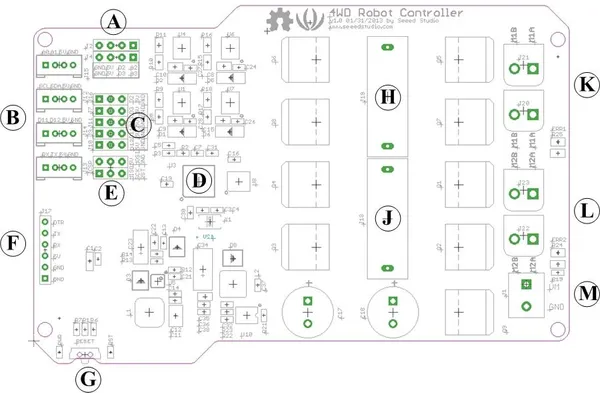

# Hercules Dual 15A 6-20V Motor Controller

**Seeed Studio** · Source collection

Revision: Unverified source identity  
Coverage: Source collection; review pending

[Browse all manufacturers](../../../../BROWSE.md) · [Desktop app](https://github.com/valleytechsolutions/black-wire-desktop)

## Hardware Overview

**source reference** · Unreviewed source · JPG

[Open original reference](../../../../library/media/3b4c9f59fc7a18f00c6949f7108ddf37f089394c03d2324e1b98185942818ca9.jpg)

**Credit and rights:** Source rights not yet established. Source/manufacturer: Seeed Studio.

[Source 1](https://files.seeedstudio.com/wiki/Hercules_Dual_15A_6-20V_Motor_Controller/img/4WD_Robot_Controller_Interface_Function.jpg) · [Source 2](https://wiki.seeedstudio.com/Hercules_Dual_15A_6-20V_Motor_Controller/)

Original source index: Hardware Overview. This file is searchable but has not been promoted to a reviewed physical board pinout.

SHA-256: `3b4c9f59fc7a18f00c6949f7108ddf37f089394c03d2324e1b98185942818ca9`

Pin assignments have not been independently electrically verified. Check board revision before wiring.
