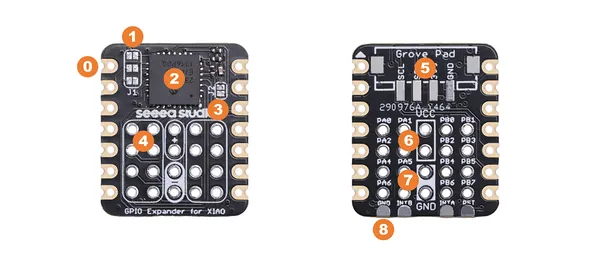

# IO Expander for XIAO

**Seeed Studio** · Source collection

Revision: Unverified source identity  
Coverage: Source collection; review pending

[Browse all manufacturers](../../../../BROWSE.md) · [Desktop app](https://github.com/valleytechsolutions/black-wire-desktop)

## Hardware Overview

**source reference** · Unreviewed source · PNG

[Open original reference](../../../../library/media/7224b835ebcbc1fbb597b7d0f33a43fc623369a4558e7d86d5d8cb1c5153a6d7.png)

**Credit and rights:** Source rights not yet established. Source/manufacturer: Seeed Studio.

[Source 1](https://files.seeedstudio.com/wiki/gpio-expander-for-xiao/2.png) · [Source 2](https://wiki.seeedstudio.com/io_expander_for_xiao/)

Original source index: Hardware Overview. This file is searchable but has not been promoted to a reviewed physical board pinout.

SHA-256: `7224b835ebcbc1fbb597b7d0f33a43fc623369a4558e7d86d5d8cb1c5153a6d7`

Pin assignments have not been independently electrically verified. Check board revision before wiring.
