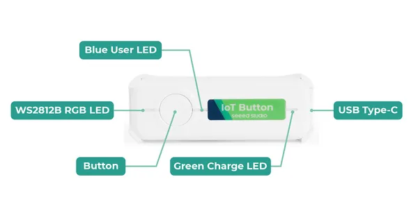

# IoT Button

**Seeed Studio** · Source collection

Revision: Unverified source identity  
Coverage: Source collection; review pending

[Browse all manufacturers](../../../../BROWSE.md) · [Desktop app](https://github.com/valleytechsolutions/black-wire-desktop)

## Hardware Overview

**source reference** · Unreviewed source · PNG

[Open original reference](../../../../library/media/9226012a7eb18bb6639588d0e01f20f8d589a141d0ecd4d11d695245ebf301d1.png)

**Credit and rights:** Source rights not yet established. Source/manufacturer: Seeed Studio.

[Source 1](https://files.seeedstudio.com/wiki/IoT_Botton_ESPHOME/3.png) · [Source 2](https://wiki.seeedstudio.com/getting_started_with_seeed_iot_button/)

Original source index: Hardware Overview. This file is searchable but has not been promoted to a reviewed physical board pinout.

SHA-256: `9226012a7eb18bb6639588d0e01f20f8d589a141d0ecd4d11d695245ebf301d1`

Pin assignments have not been independently electrically verified. Check board revision before wiring.
