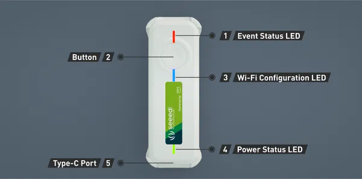

# IoT Button for AWS

**Seeed Studio** · Source collection

Revision: Unverified source identity  
Coverage: Source collection; review pending

[Browse all manufacturers](../../../../BROWSE.md) · [Desktop app](https://github.com/valleytechsolutions/black-wire-desktop)

## Hardware Overview

**source reference** · Unreviewed source · PNG

[Open original reference](../../../../library/media/84e92f98a658fbfa561d1f720c3036b4414b1e77f0455d01f6db4008d6f25b41.png)

**Credit and rights:** Source rights not yet established. Source/manufacturer: Seeed Studio.

[Source 1](https://files.seeedstudio.com/wiki/Seeed-IOT-BUTTON-FOR-AWS/img/Seeed_IOT_Button_HardwareOverview.png) · [Source 2](https://wiki.seeedstudio.com/SEEED-IOT-BUTTON-FOR-AWS/)

Original source index: Hardware Overview. This file is searchable but has not been promoted to a reviewed physical board pinout.

SHA-256: `84e92f98a658fbfa561d1f720c3036b4414b1e77f0455d01f6db4008d6f25b41`

Pin assignments have not been independently electrically verified. Check board revision before wiring.
