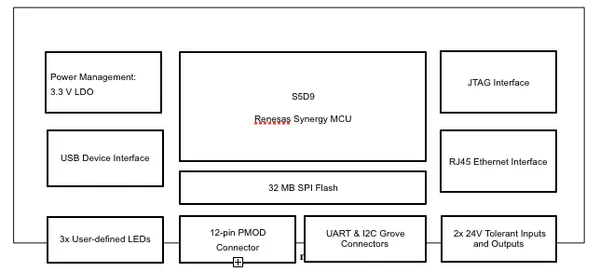
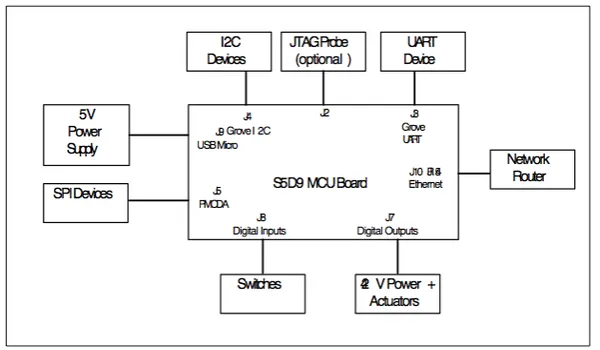
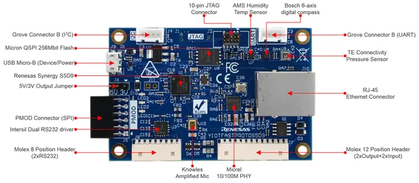
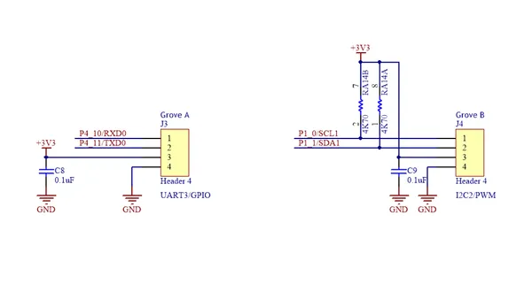
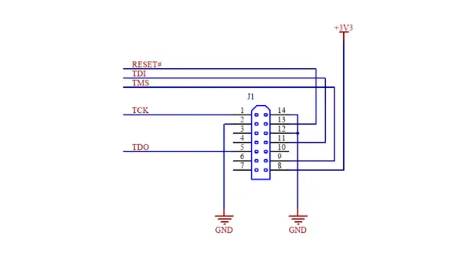
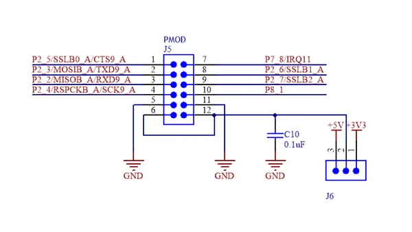
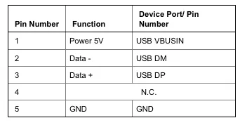
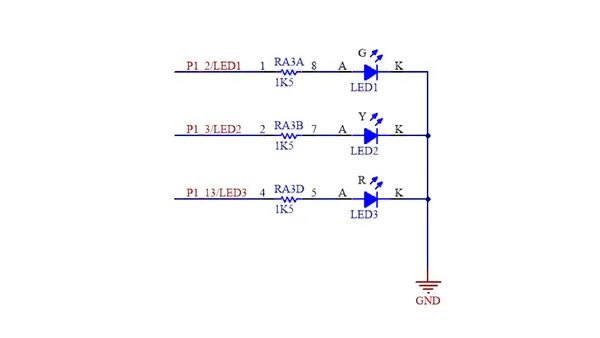

# IoT Fast Prototyping Kit S5D9

**Seeed Studio** · Source collection

Revision: Unverified source identity  
Coverage: Source collection; review pending

[Browse all manufacturers](../../../../BROWSE.md) · [Desktop app](https://github.com/valleytechsolutions/black-wire-desktop)

## Block Diagram 2

**source reference** · Unreviewed source · PNG

[Open original reference](../../../../library/media/857c37a87bcf125e48eab32d8d433b97895706697d4507eeb048d5737199abb6.png)

**Credit and rights:** Source rights not yet established. Source/manufacturer: Seeed Studio.

[Source 1](https://files.seeedstudio.com/wiki/IoT_Fast_Prototyping_Kit_S5D9_User_Manual/img/Figure%203.1.png) · [Source 2](https://wiki.seeedstudio.com/IoT_Fast_Prototyping_Kit_S5D9/)

Original source index: Block Diagram 2. This file is searchable but has not been promoted to a reviewed physical board pinout.

SHA-256: `857c37a87bcf125e48eab32d8d433b97895706697d4507eeb048d5737199abb6`

## Block Diagram

**source reference** · Unreviewed source · PNG

[Open original reference](../../../../library/media/9af22ab6314097748f36adaed00f8848300f2cd4a28e3180a03874bba330c298.png)

**Credit and rights:** Source rights not yet established. Source/manufacturer: Seeed Studio.

[Source 1](https://files.seeedstudio.com/wiki/IoT_Fast_Prototyping_Kit_S5D9_User_Manual/img/Connection%20Diagram.png) · [Source 2](https://wiki.seeedstudio.com/IoT_Fast_Prototyping_Kit_S5D9/)

Original source index: Block Diagram. This file is searchable but has not been promoted to a reviewed physical board pinout.

SHA-256: `9af22ab6314097748f36adaed00f8848300f2cd4a28e3180a03874bba330c298`

## Hardware Overview

**source reference** · Unreviewed source · PNG

[Open original reference](../../../../library/media/09194ae745c25b809c5e321cff0a934344e005d1ca6c2bbfffef24f1f448eed9.png)

**Credit and rights:** Source rights not yet established. Source/manufacturer: Seeed Studio.

[Source 1](https://files.seeedstudio.com/wiki/IoT_Fast_Prototyping_Kit_S5D9_User_Manual/img/Block%20Diagram.png) · [Source 2](https://wiki.seeedstudio.com/IoT_Fast_Prototyping_Kit_S5D9/)

Original source index: Hardware Overview. This file is searchable but has not been promoted to a reviewed physical board pinout.

SHA-256: `09194ae745c25b809c5e321cff0a934344e005d1ca6c2bbfffef24f1f448eed9`

## Pin Definition (Grove Connectors)

**source reference** · Unreviewed source · JPG

[Open original reference](../../../../library/media/4620ff791baed9233b885c452899bf220b7378e0db06703188c83d7cb21ed123.jpg)

**Credit and rights:** Source rights not yet established. Source/manufacturer: Seeed Studio.

[Source 1](https://files.seeedstudio.com/wiki/IoT_Fast_Prototyping_Kit_S5D9_User_Manual/img/Grove%20connector%20schematic.jpeg) · [Source 2](https://wiki.seeedstudio.com/IoT_Fast_Prototyping_Kit_S5D9/)

Original source index: Pin Definition (Grove Connectors). This file is searchable but has not been promoted to a reviewed physical board pinout.

SHA-256: `4620ff791baed9233b885c452899bf220b7378e0db06703188c83d7cb21ed123`

## Pin Definition (JTAG Connector J1)

**source reference** · Unreviewed source · PNG

[Open original reference](../../../../library/media/4851a02b45cb8acc26c79776a07aaa51333c06114018295a269a6a2216add421.png)

**Credit and rights:** Source rights not yet established. Source/manufacturer: Seeed Studio.

[Source 1](https://files.seeedstudio.com/wiki/IoT_Fast_Prototyping_Kit_S5D9_User_Manual/img/JTAG%20probe%20interface%20connections.png) · [Source 2](https://wiki.seeedstudio.com/IoT_Fast_Prototyping_Kit_S5D9/)

Original source index: Pin Definition (JTAG Connector J1). This file is searchable but has not been promoted to a reviewed physical board pinout.

SHA-256: `4851a02b45cb8acc26c79776a07aaa51333c06114018295a269a6a2216add421`

## Pin Definition (PMOD Connector)

**source reference** · Unreviewed source · JPG

[Open original reference](../../../../library/media/33d9a0d495bcd502218ebaab327e5aa1bb20297fd2404cc4c285ddc75c228460.jpg)

**Credit and rights:** Source rights not yet established. Source/manufacturer: Seeed Studio.

[Source 1](https://files.seeedstudio.com/wiki/IoT_Fast_Prototyping_Kit_S5D9_User_Manual/img/PMOD%20schematic.jpeg) · [Source 2](https://wiki.seeedstudio.com/IoT_Fast_Prototyping_Kit_S5D9/)

Original source index: Pin Definition (PMOD Connector). This file is searchable but has not been promoted to a reviewed physical board pinout.

SHA-256: `33d9a0d495bcd502218ebaab327e5aa1bb20297fd2404cc4c285ddc75c228460`

## Pin Definition Table

**source reference** · Unreviewed source · PNG

[Open original reference](../../../../library/media/d7c78ce787aef8b34bf689fa6e1f216af8d4cb67bfef8ba437e4a93b4d8382ef.png)

**Credit and rights:** Source rights not yet established. Source/manufacturer: Seeed Studio.

[Source 1](https://files.seeedstudio.com/wiki/IoT_Fast_Prototyping_Kit_S5D9_User_Manual/img/Table%206.1%20USB%20Micro%20B%20Type%20Receptacle%20-%20Device%20Mode.png) · [Source 2](https://wiki.seeedstudio.com/IoT_Fast_Prototyping_Kit_S5D9/)

Original source index: Pin Definition Table. This file is searchable but has not been promoted to a reviewed physical board pinout.

SHA-256: `d7c78ce787aef8b34bf689fa6e1f216af8d4cb67bfef8ba437e4a93b4d8382ef`

## Pin Functions (LEDs)

**source reference** · Unreviewed source · PNG

[Open original reference](../../../../library/media/73b1d18307d91b7efd1fa67437231e714f26e8d6b227149b3433bea8fa44d8d0.png)

**Credit and rights:** Source rights not yet established. Source/manufacturer: Seeed Studio.

[Source 1](https://files.seeedstudio.com/wiki/IoT_Fast_Prototyping_Kit_S5D9_User_Manual/img/Mapping%20between%20LEDs%2C%20ports.png) · [Source 2](https://wiki.seeedstudio.com/IoT_Fast_Prototyping_Kit_S5D9/)

Original source index: Pin Functions (LEDs). This file is searchable but has not been promoted to a reviewed physical board pinout.

SHA-256: `73b1d18307d91b7efd1fa67437231e714f26e8d6b227149b3433bea8fa44d8d0`

Pin assignments have not been independently electrically verified. Check board revision before wiring.
