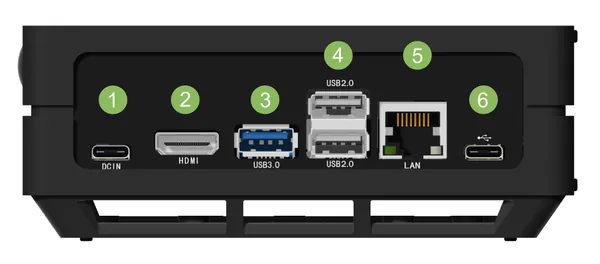

# J101 Carrier Board

**Seeed Studio** · Source collection

Revision: Unverified source identity  
Coverage: Source collection; review pending

[Browse all manufacturers](../../../../BROWSE.md) · [Desktop app](https://github.com/valleytechsolutions/black-wire-desktop)

## Hardware Overview

**source reference** · Unreviewed source · PNG

[Open original reference](../../../../library/media/309130674ce1ee305e71254d6bd0713f2d6c6645bdd24e4905b59ea3f10d9aec.png)

**Credit and rights:** Source rights not yet established. Source/manufacturer: Seeed Studio.

[Source 1](https://files.seeedstudio.com/wiki/recomputer-Jetson-20-1-H1/jetson-a01mark.png) · [Source 2](https://wiki.seeedstudio.com/reComputer_Jetson_Series_Introduction/)

Original source index: Hardware Overview. This file is searchable but has not been promoted to a reviewed physical board pinout.

SHA-256: `309130674ce1ee305e71254d6bd0713f2d6c6645bdd24e4905b59ea3f10d9aec`

## Pin Definition

**source reference** · Unreviewed source · PDF

[Open original reference](../../../../library/media/3333f53a6c4f71e314e25d9b5a216d3f2730ac0f308b5b6d884863bd3068ce45.pdf)

**Credit and rights:** Source rights not yet established. Source/manufacturer: Seeed Studio.

[Source 1](https://files.seeedstudio.com/wiki/reComputer/reComputer-J1010-datasheet.pdf) · [Source 2](https://wiki.seeedstudio.com/reComputer_J1010_J101_Flash_Jetpack/)

Original source index: Pin Definition. This file is searchable but has not been promoted to a reviewed physical board pinout.

SHA-256: `3333f53a6c4f71e314e25d9b5a216d3f2730ac0f308b5b6d884863bd3068ce45`

Pin assignments have not been independently electrically verified. Check board revision before wiring.
