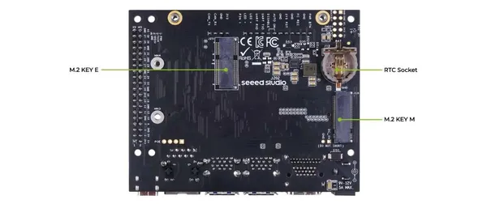
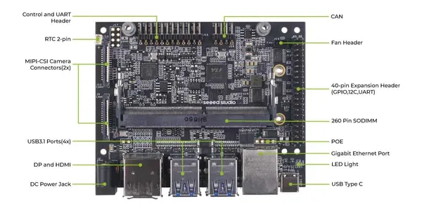

# J202 Carrier Board

**Seeed Studio** · Source collection

Revision: Unverified source identity  
Coverage: Source collection; review pending

[Browse all manufacturers](../../../../BROWSE.md) · [Desktop app](https://github.com/valleytechsolutions/black-wire-desktop)

## Hardware Overview (Back)

**source reference** · Unreviewed source · JPG

[Open original reference](../../../../library/media/c0fa6cae822f92323f266c31db7792588b1d22392552f70867a7cba9feca7775.jpg)

**Credit and rights:** Source rights not yet established. Source/manufacturer: Seeed Studio.

[Source 1](https://files.seeedstudio.com/wiki/reComputer-Jetson/J202/J202_2.jpg) · [Source 2](https://wiki.seeedstudio.com/reComputer_J2021_J202_Flash_Jetpack/)

Original source index: Hardware Overview (Back). This file is searchable but has not been promoted to a reviewed physical board pinout.

SHA-256: `c0fa6cae822f92323f266c31db7792588b1d22392552f70867a7cba9feca7775`

## Hardware Overview (Front)

**source reference** · Unreviewed source · JPG

[Open original reference](../../../../library/media/0a115b72234a6a96e5f3d07056be7c4f9fb5cdffc612973fd6308a410213f44a.jpg)

**Credit and rights:** Source rights not yet established. Source/manufacturer: Seeed Studio.

[Source 1](https://files.seeedstudio.com/wiki/reComputer-Jetson/J202/J202_1.jpg) · [Source 2](https://wiki.seeedstudio.com/reComputer_J2021_J202_Flash_Jetpack/)

Original source index: Hardware Overview (Front). This file is searchable but has not been promoted to a reviewed physical board pinout.

SHA-256: `0a115b72234a6a96e5f3d07056be7c4f9fb5cdffc612973fd6308a410213f44a`

Pin assignments have not been independently electrically verified. Check board revision before wiring.
