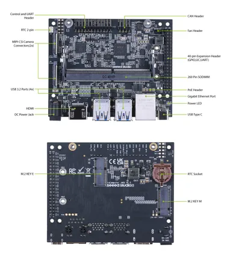
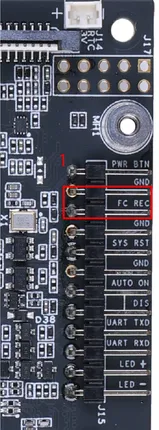

# J401 Carrier Board

**Seeed Studio** · Source collection

Revision: Unverified source identity

Coverage: Source collection; review pending

[Browse all manufacturers](../../../../BROWSE.md) · [Devices & IoT](../../../../DEVICES.md) · [Open in the browser guide](https://valleytech-black-wire-guide.pages.dev/?board=source-board-117e877111f3bbb924)

## Datasheets and original documentation

Board datasheet: **not yet recorded**. Visual reference: **available**.

[Manufacturer source (recorded link)](https://wiki.seeedstudio.com/J401_carrierboard_Hardware_Interfaces_Usage/)

A chip datasheet, schematic and board datasheet have different scopes. Match the exact hardware revision.

[Documentation coverage and remaining gaps](../../../../DOCUMENTATION.md)

## Hardware Overview

**source reference** · Unreviewed source · JPG

[Open original reference](../../../../library/media/48e8827c5136a2a503fd3b18378be6a97f948a96d1e9fcf5b421568503a598f6.jpg)

**Credit and rights:** Source rights not yet established. Source/manufacturer: Seeed Studio.

[Source 1](https://wdcdn.qpic.cn/MTY4ODg1NTkyNTI4NTE1NA_356376_xs4inuEPMdjVeyj__1679475367?w=1200&h=1335) · [Source 2](https://wiki.seeedstudio.com/J401_carrierboard_Hardware_Interfaces_Usage/)

Original source index: Hardware Overview. This file is searchable but has not been promoted to a reviewed physical board pinout.

Image revision: Not identified

SHA-256: `48e8827c5136a2a503fd3b18378be6a97f948a96d1e9fcf5b421568503a598f6`

## Pin Functions (Control Header)

**source reference** · Unreviewed source · PNG

[Open original reference](../../../../library/media/563ea3413fbef33ef74f608e597a85b20a309308eb5e4211c8d5d3a23b926e9c.png)

**Credit and rights:** Source rights not yet established. Source/manufacturer: Seeed Studio.

[Source 1](https://files.seeedstudio.com/wiki/reComputer-J4012/1.png) · [Source 2](https://wiki.seeedstudio.com/reComputer_J4012_Flash_Jetpack/)

Original source index: Pin Functions (Control Header). This file is searchable but has not been promoted to a reviewed physical board pinout.

Image revision: Not identified

SHA-256: `563ea3413fbef33ef74f608e597a85b20a309308eb5e4211c8d5d3a23b926e9c`

Pin assignments have not been independently electrically verified. Check board revision before wiring.
