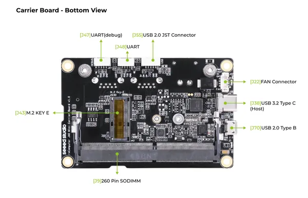
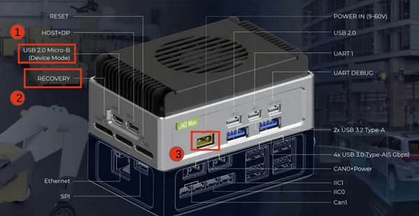
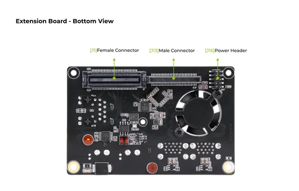
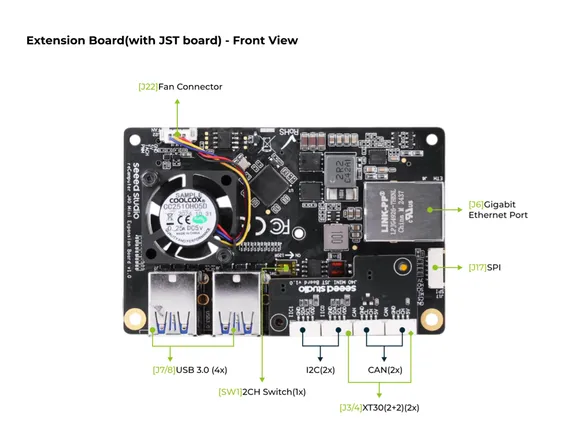
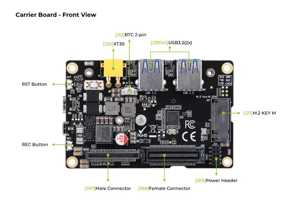

# J401-Mini Carrier Board

**Seeed Studio** · Source collection

Revision: Unverified source identity  
Coverage: Source collection; review pending

[Browse all manufacturers](../../../../BROWSE.md) · [Desktop app](https://github.com/valleytechsolutions/black-wire-desktop)

## Hardware Overview (Bottom)

**source reference** · Unreviewed source · PNG

[Open original reference](../../../../library/media/781b7ea5f302212b6af48e890c619b27fd9a5e1384ddd75d515b69866f693b39.png)

**Credit and rights:** Source rights not yet established. Source/manufacturer: Seeed Studio.

[Source 1](https://files.seeedstudio.com/wiki/reComputer-Jetson/mini/B2.png) · [Source 2](https://wiki.seeedstudio.com/recomputer_mini_j401_getting_started/)

Original source index: Hardware Overview (Bottom). This file is searchable but has not been promoted to a reviewed physical board pinout.

SHA-256: `781b7ea5f302212b6af48e890c619b27fd9a5e1384ddd75d515b69866f693b39`

## Hardware Overview (Enclosure)

**source reference** · Unreviewed source · PNG

[Open original reference](../../../../library/media/d2691730f8678665b8c1534530b883a3e64494f3fc942f072aa2be317b7a3654.png)

**Credit and rights:** Source rights not yet established. Source/manufacturer: Seeed Studio.

[Source 1](https://files.seeedstudio.com/wiki/reComputer-Jetson/mini/reComputer_mini_rec.png) · [Source 2](https://wiki.seeedstudio.com/recomputer_mini_j401_getting_started/)

Original source index: Hardware Overview (Enclosure). This file is searchable but has not been promoted to a reviewed physical board pinout.

SHA-256: `d2691730f8678665b8c1534530b883a3e64494f3fc942f072aa2be317b7a3654`

## Hardware Overview (Extension Bottom)

**source reference** · Unreviewed source · PNG

[Open original reference](../../../../library/media/f915070b695894c490af5bbe8c22714cf596bdedf79002af200c65c4e5f835fc.png)

**Credit and rights:** Source rights not yet established. Source/manufacturer: Seeed Studio.

[Source 1](https://files.seeedstudio.com/wiki/reComputer-Jetson/mini/B4.png) · [Source 2](https://wiki.seeedstudio.com/recomputer_mini_j401_getting_started/)

Original source index: Hardware Overview (Extension Bottom). This file is searchable but has not been promoted to a reviewed physical board pinout.

SHA-256: `f915070b695894c490af5bbe8c22714cf596bdedf79002af200c65c4e5f835fc`

## Hardware Overview (Extension Front)

**source reference** · Unreviewed source · PNG

[Open original reference](../../../../library/media/237e24372d768e07f0aaf7532e08d77d3bbf59dae9d13f32a939d8c504365dfb.png)

**Credit and rights:** Source rights not yet established. Source/manufacturer: Seeed Studio.

[Source 1](https://files.seeedstudio.com/wiki/reComputer-Jetson/mini/B3.png) · [Source 2](https://wiki.seeedstudio.com/recomputer_mini_j401_getting_started/)

Original source index: Hardware Overview (Extension Front). This file is searchable but has not been promoted to a reviewed physical board pinout.

SHA-256: `237e24372d768e07f0aaf7532e08d77d3bbf59dae9d13f32a939d8c504365dfb`

## Hardware Overview (Front)

**source reference** · Unreviewed source · PNG

[Open original reference](../../../../library/media/fe6d630bd3b7cda27e63d075316c30c6c7632cb9ef508957bb6acfa3e2232d7b.png)

**Credit and rights:** Source rights not yet established. Source/manufacturer: Seeed Studio.

[Source 1](https://files.seeedstudio.com/wiki/reComputer-Jetson/mini/B1.png) · [Source 2](https://wiki.seeedstudio.com/recomputer_mini_j401_getting_started/)

Original source index: Hardware Overview (Front). This file is searchable but has not been promoted to a reviewed physical board pinout.

SHA-256: `fe6d630bd3b7cda27e63d075316c30c6c7632cb9ef508957bb6acfa3e2232d7b`

Pin assignments have not been independently electrically verified. Check board revision before wiring.
