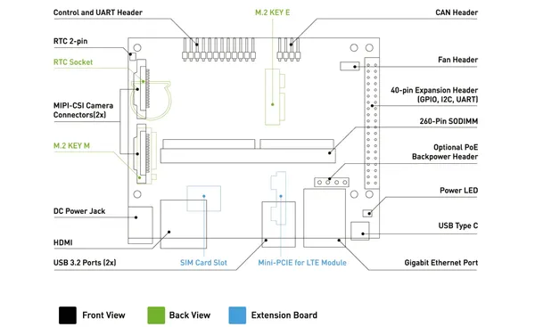

# J401B Carrier Board

**Seeed Studio** · Source collection

Revision: Unverified source identity  
Coverage: Source collection; review pending

[Browse all manufacturers](../../../../BROWSE.md) · [Desktop app](https://github.com/valleytechsolutions/black-wire-desktop)

## Interfaces

**source reference** · Unreviewed source · PNG

[Open original reference](../../../../library/media/65fe5b11e2ee17ae035c36fa0bf4aa3f07b8d18a175e194bd4d7c02fc01673b2.png)

**Credit and rights:** Source rights not yet established. Source/manufacturer: Seeed Studio.

[Source 1](https://files.seeedstudio.com/wiki/reComputer-Jetson/J401B/j401b_interfaces.png) · [Source 2](https://wiki.seeedstudio.com/recomputer_j401b_interfaces_usage/)

Original source index: Interfaces. This file is searchable but has not been promoted to a reviewed physical board pinout.

SHA-256: `65fe5b11e2ee17ae035c36fa0bf4aa3f07b8d18a175e194bd4d7c02fc01673b2`

Pin assignments have not been independently electrically verified. Check board revision before wiring.
