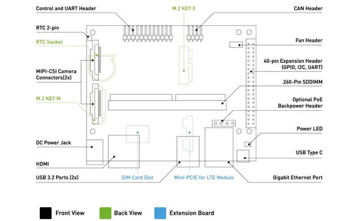

# J401B Carrier Board

**Seeed Studio** · Source collection

Revision: Unverified source identity

Coverage: Source collection; review pending

[Browse all manufacturers](../../../../BROWSE.md) · [Devices & IoT](../../../../DEVICES.md) · [Open in the browser guide](https://valleytech-black-wire-guide.pages.dev/?board=source-board-83eada24dce1ad6b97)

## Datasheets and original documentation

Board datasheet: **not yet recorded**. Visual reference: **available**.

[Manufacturer source (recorded link)](https://wiki.seeedstudio.com/recomputer_j401b_interfaces_usage/)

A chip datasheet, schematic and board datasheet have different scopes. Match the exact hardware revision.

[Documentation coverage and remaining gaps](../../../../DOCUMENTATION.md)

## Interfaces

**source reference** · Unreviewed source · PNG

[Open original reference](../../../../library/media/65fe5b11e2ee17ae035c36fa0bf4aa3f07b8d18a175e194bd4d7c02fc01673b2.png)

**Credit and rights:** Source rights not yet established. Source/manufacturer: Seeed Studio.

[Source 1](https://files.seeedstudio.com/wiki/reComputer-Jetson/J401B/j401b_interfaces.png) · [Source 2](https://wiki.seeedstudio.com/recomputer_j401b_interfaces_usage/)

Original source index: Interfaces. This file is searchable but has not been promoted to a reviewed physical board pinout.

Image revision: Not identified

SHA-256: `65fe5b11e2ee17ae035c36fa0bf4aa3f07b8d18a175e194bd4d7c02fc01673b2`

Pin assignments have not been independently electrically verified. Check board revision before wiring.
