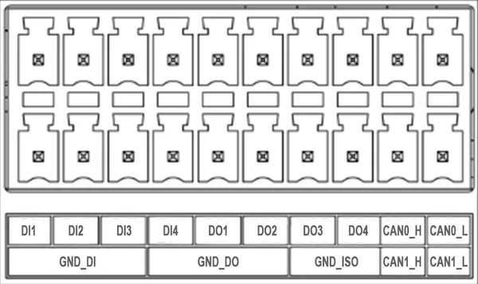

# J501 Carrier Board

**Seeed Studio** · Source collection

Revision: Unverified source identity  
Coverage: Source collection; review pending

[Browse all manufacturers](../../../../BROWSE.md) · [Desktop app](https://github.com/valleytechsolutions/black-wire-desktop)

## Pin Definition Table (DI-DO-CAN)

**source reference** · Unreviewed source · JPG

[Open original reference](../../../../library/media/afbefa3a25bf5adfcd4b860333bdd5627f8168a3212e7f95e9a9ad92749b428a.jpg)

**Credit and rights:** Source rights not yet established. Source/manufacturer: Seeed Studio.

[Source 1](https://files.seeedstudio.com/wiki/reComputer-Jetson/J501/dido.jpeg) · [Source 2](https://wiki.seeedstudio.com/j501_carrier_board_interfaces_usage/)

Original source index: Pin Definition Table (DI-DO-CAN). This file is searchable but has not been promoted to a reviewed physical board pinout.

SHA-256: `afbefa3a25bf5adfcd4b860333bdd5627f8168a3212e7f95e9a9ad92749b428a`

Pin assignments have not been independently electrically verified. Check board revision before wiring.
