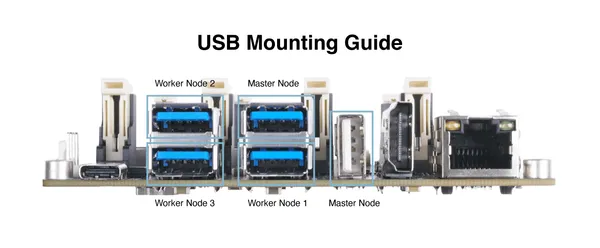
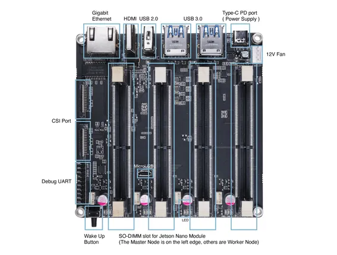

# Jetson Mate

**Seeed Studio** · Source collection

Revision: Unverified source identity  
Coverage: Source collection; review pending

[Browse all manufacturers](../../../../BROWSE.md) · [Desktop app](https://github.com/valleytechsolutions/black-wire-desktop)

## Hardware Overview (USB Mounting Guide)

**source reference** · Unreviewed source · PNG

[Open original reference](../../../../library/media/848466020eb647eb984a583bf7ba3c3cdcad9c84869fc8cc3a14dd62e686e0a5.png)

**Credit and rights:** Source rights not yet established. Source/manufacturer: Seeed Studio.

[Source 1](https://files.seeedstudio.com/wiki/Jetson-Mate/JetsonMate-2.png) · [Source 2](https://wiki.seeedstudio.com/Jetson-Mate/)

Original source index: Hardware Overview (USB Mounting Guide). This file is searchable but has not been promoted to a reviewed physical board pinout.

SHA-256: `848466020eb647eb984a583bf7ba3c3cdcad9c84869fc8cc3a14dd62e686e0a5`

## Hardware Overview

**source reference** · Unreviewed source · PNG

[Open original reference](../../../../library/media/0cf16e49150acc84e2a6a66fc7c74805b4de300022cfd1c136d18fe529180e5b.png)

**Credit and rights:** Source rights not yet established. Source/manufacturer: Seeed Studio.

[Source 1](https://files.seeedstudio.com/wiki/Jetson-Mate/JetsonMate.png) · [Source 2](https://wiki.seeedstudio.com/Jetson-Mate/)

Original source index: Hardware Overview. This file is searchable but has not been promoted to a reviewed physical board pinout.

SHA-256: `0cf16e49150acc84e2a6a66fc7c74805b4de300022cfd1c136d18fe529180e5b`

Pin assignments have not been independently electrically verified. Check board revision before wiring.
