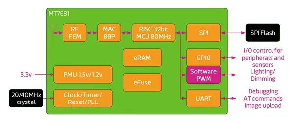

# LinkIt Connect 7681

**Seeed Studio** · Source collection

Revision: Unverified source identity  
Coverage: Source collection; review pending

[Browse all manufacturers](../../../../BROWSE.md) · [Desktop app](https://github.com/valleytechsolutions/black-wire-desktop)

## Block Diagram

**source reference** · Unreviewed source · JPG

[Open original reference](../../../../library/media/c64ab67fb6d6af2c1840f611bf3e0a9c51e2b6e4e998cbd777ff4d4753ebb27d.jpg)

**Credit and rights:** Source rights not yet established. Source/manufacturer: Seeed Studio.

[Source 1](https://files.seeedstudio.com/wiki/Linkit_Connect_7681/img/Linkit_Connect_7681_Block_Diagram.jpg) · [Source 2](https://wiki.seeedstudio.com/Linkit_Connect_7681/)

Original source index: Block Diagram. This file is searchable but has not been promoted to a reviewed physical board pinout.

SHA-256: `c64ab67fb6d6af2c1840f611bf3e0a9c51e2b6e4e998cbd777ff4d4753ebb27d`

Pin assignments have not been independently electrically verified. Check board revision before wiring.
