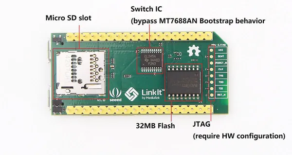
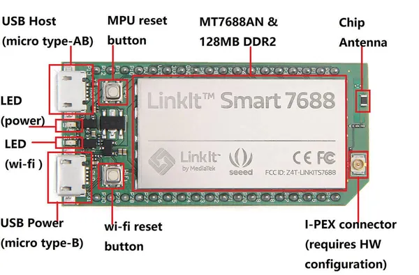

# LinkIt Smart 7688

**Seeed Studio** · Source collection

Revision: Unverified source identity  
Coverage: Source collection; review pending

[Browse all manufacturers](../../../../BROWSE.md) · [Desktop app](https://github.com/valleytechsolutions/black-wire-desktop)

## Hardware Overview (Back)

**source reference** · Unreviewed source · JPG

[Open original reference](../../../../library/media/b7369c6ac53140285d4d43b533e195f2faf516e51c314e726cf3ac512ce1539a.jpg)

**Credit and rights:** Source rights not yet established. Source/manufacturer: Seeed Studio.

Original source index: Hardware Overview (Back). This file is searchable but has not been promoted to a reviewed physical board pinout.

SHA-256: `b7369c6ac53140285d4d43b533e195f2faf516e51c314e726cf3ac512ce1539a`

## Hardware Overview (Front)

**source reference** · Unreviewed source · JPG

[Open original reference](../../../../library/media/ded551d983ef3cb99dfc7c0bb5586887f63895da6907fc0eb039ef36a7091e66.jpg)

**Credit and rights:** Source rights not yet established. Source/manufacturer: Seeed Studio.

Original source index: Hardware Overview (Front). This file is searchable but has not been promoted to a reviewed physical board pinout.

SHA-256: `ded551d983ef3cb99dfc7c0bb5586887f63895da6907fc0eb039ef36a7091e66`

Pin assignments have not been independently electrically verified. Check board revision before wiring.
