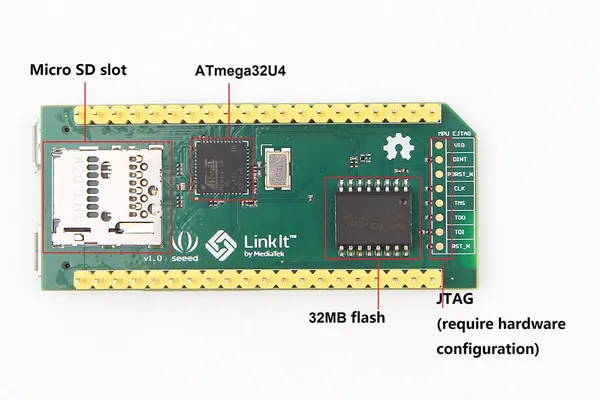
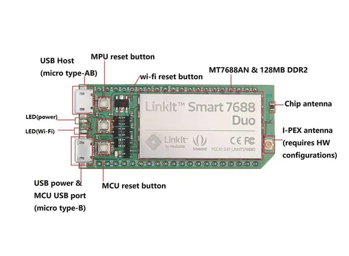

# LinkIt Smart 7688 Duo

**Seeed Studio** · Source collection

Revision: Unverified source identity  
Coverage: Source collection; review pending

[Browse all manufacturers](../../../../BROWSE.md) · [Desktop app](https://github.com/valleytechsolutions/black-wire-desktop)

## Hardware Overview (Back)

**source reference** · Unreviewed source · JPG

[Open original reference](../../../../library/media/013190782b419eeb5a7d5df1bec74e6d72c6df0bd33ec8ed23fb5bf9b86719fc.jpg)

**Credit and rights:** Source rights not yet established. Source/manufacturer: Seeed Studio.

Original source index: Hardware Overview (Back). This file is searchable but has not been promoted to a reviewed physical board pinout.

SHA-256: `013190782b419eeb5a7d5df1bec74e6d72c6df0bd33ec8ed23fb5bf9b86719fc`

## Hardware Overview (Front)

**source reference** · Unreviewed source · JPG

[Open original reference](../../../../library/media/c426e3bd8af5759d47521b109e82d42c9e643f60f36f26da1ddf0165562fd72c.jpg)

**Credit and rights:** Source rights not yet established. Source/manufacturer: Seeed Studio.

Original source index: Hardware Overview (Front). This file is searchable but has not been promoted to a reviewed physical board pinout.

SHA-256: `c426e3bd8af5759d47521b109e82d42c9e643f60f36f26da1ddf0165562fd72c`

Pin assignments have not been independently electrically verified. Check board revision before wiring.
