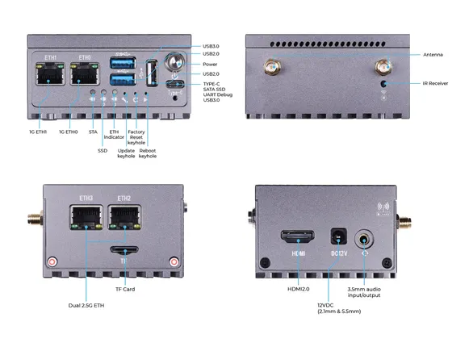

# LinkStar H68K

**Seeed Studio** · Source collection

Revision: Unverified source identity  
Coverage: Source collection; review pending

[Browse all manufacturers](../../../../BROWSE.md) · [Desktop app](https://github.com/valleytechsolutions/black-wire-desktop)

## Hardware Overview (Ports)

**source reference** · Unreviewed source · JPG

[Open original reference](../../../../library/media/2505da42f8e5093259eddba295607300f73b9f5ce30854ff96d78ac8e08296e4.jpg)

**Credit and rights:** Source rights not yet established. Source/manufacturer: Seeed Studio.

[Source 1](https://files.seeedstudio.com/wiki/LinkStar/hardware_overview1.jpg) · [Source 2](https://wiki.seeedstudio.com/Linkstar_Datasheet/)

Original source index: Hardware Overview (Ports). This file is searchable but has not been promoted to a reviewed physical board pinout.

SHA-256: `2505da42f8e5093259eddba295607300f73b9f5ce30854ff96d78ac8e08296e4`

Pin assignments have not been independently electrically verified. Check board revision before wiring.
