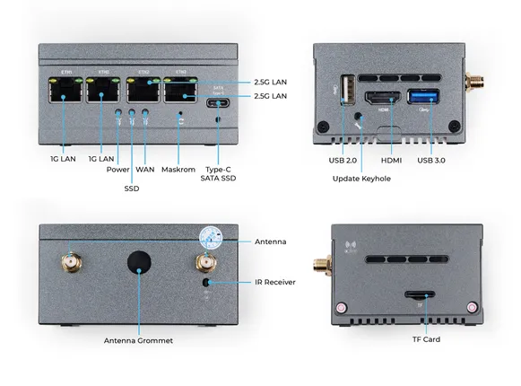

# LinkStar H68K V2

**Seeed Studio** · Source collection

Revision: Unverified source identity  
Coverage: Source collection; review pending

[Browse all manufacturers](../../../../BROWSE.md) · [Desktop app](https://github.com/valleytechsolutions/black-wire-desktop)

## Hardware Overview (Ports)

**source reference** · Unreviewed source · JPG

[Open original reference](../../../../library/media/0c42c101d8bdee05ad577722b424a5d5b218481487689c5f3d7f1e65af49551a.jpg)

**Credit and rights:** Source rights not yet established. Source/manufacturer: Seeed Studio.

[Source 1](https://files.seeedstudio.com/wiki/LinkStar_V2/02.jpg) · [Source 2](https://wiki.seeedstudio.com/h68kv2_datasheet/)

Original source index: Hardware Overview (Ports). This file is searchable but has not been promoted to a reviewed physical board pinout.

SHA-256: `0c42c101d8bdee05ad577722b424a5d5b218481487689c5f3d7f1e65af49551a`

Pin assignments have not been independently electrically verified. Check board revision before wiring.
