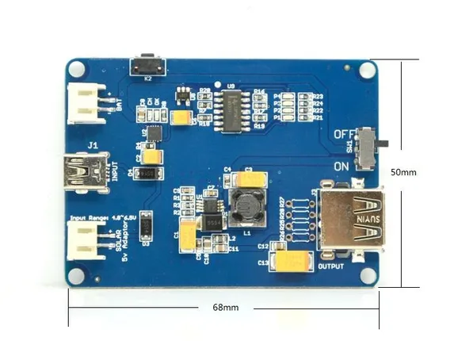
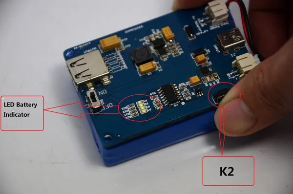

# Lipo Rider Pro

**Seeed Studio** · Source collection

Revision: Unverified source identity

Coverage: Source collection; review pending

[Browse all manufacturers](../../../../BROWSE.md) · [Devices & IoT](../../../../DEVICES.md) · [Open in the browser guide](https://valleytech-black-wire-guide.pages.dev/?board=source-board-edfaabdc714ee27cdb)

## Datasheets and original documentation

Board datasheet: **not yet recorded**. Visual reference: **available**.

[Manufacturer source (recorded link)](https://wiki.seeedstudio.com/Lipo_Rider_Pro/)

A chip datasheet, schematic and board datasheet have different scopes. Match the exact hardware revision.

[Documentation coverage and remaining gaps](../../../../DOCUMENTATION.md)

## Dimensions

**source reference** · Unreviewed source · JPG

[Open original reference](../../../../library/media/eaf067846ead70ac3c6e27bfceeaad245deebc73681e34014db47ae7845190b7.jpg)

**Credit and rights:** Source rights not yet established. Source/manufacturer: Seeed Studio.

[Source 1](https://files.seeedstudio.com/wiki/Lipo_Rider_Pro/img/Liporiderprod.jpg) · [Source 2](https://wiki.seeedstudio.com/Lipo_Rider_Pro/)

Original source index: Dimensions. This file is searchable but has not been promoted to a reviewed physical board pinout.

Image revision: Not identified

SHA-256: `eaf067846ead70ac3c6e27bfceeaad245deebc73681e34014db47ae7845190b7`

## Hardware Overview

**source reference** · Unreviewed source · JPG

[Open original reference](../../../../library/media/0a0643f647addd186ac7eb1f19fb57ed73a19153ce4c945349113eb4d649e9f2.jpg)

**Credit and rights:** Source rights not yet established. Source/manufacturer: Seeed Studio.

[Source 1](https://files.seeedstudio.com/wiki/Lipo_Rider_Pro/img/Lipo3.jpg) · [Source 2](https://wiki.seeedstudio.com/Lipo_Rider_Pro/)

Original source index: Hardware Overview. This file is searchable but has not been promoted to a reviewed physical board pinout.

Image revision: Not identified

SHA-256: `0a0643f647addd186ac7eb1f19fb57ed73a19153ce4c945349113eb4d649e9f2`

Pin assignments have not been independently electrically verified. Check board revision before wiring.
