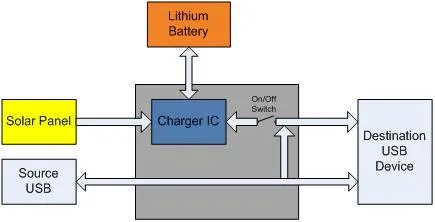

# Lipo Rider V1.1

**Seeed Studio** · Source collection

Revision: Unverified source identity  
Coverage: Source collection; review pending

[Browse all manufacturers](../../../../BROWSE.md) · [Desktop app](https://github.com/valleytechsolutions/black-wire-desktop)

## Block Diagram

**source reference** · Unreviewed source · JPG

[Open original reference](../../../../library/media/5a93c7a203b79409a800ba9984b7a89e0ec2de65ef205786a5ad7318a8f68d12.jpg)

**Credit and rights:** Source rights not yet established. Source/manufacturer: Seeed Studio.

[Source 1](https://files.seeedstudio.com/wiki/Lipo_Rider_V1.1/img/Lipo-rider-blockdiagram.JPG) · [Source 2](https://wiki.seeedstudio.com/Lipo_Rider_V1.1/)

Original source index: Block Diagram. This file is searchable but has not been promoted to a reviewed physical board pinout.

SHA-256: `5a93c7a203b79409a800ba9984b7a89e0ec2de65ef205786a5ad7318a8f68d12`

Pin assignments have not been independently electrically verified. Check board revision before wiring.
