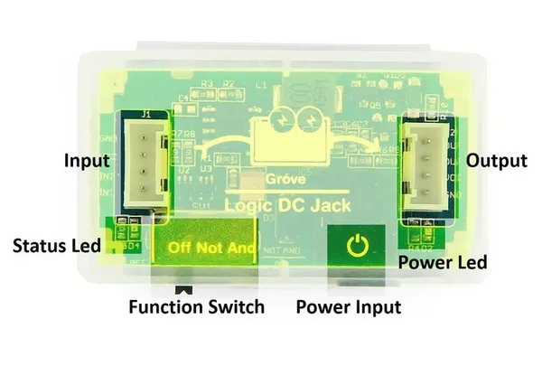

# Logic DC Jack

**Seeed Studio** · Source collection

Revision: Unverified source identity  
Coverage: Source collection; review pending

[Browse all manufacturers](../../../../BROWSE.md) · [Desktop app](https://github.com/valleytechsolutions/black-wire-desktop)

## Hardware Overview

**source reference** · Unreviewed source · JPG

[Open original reference](../../../../library/media/8d183abbf0d95cbfe73d4d53b27212f1ec4baf617fd3b6cccbf2672b6262da0a.jpg)

**Credit and rights:** Source rights not yet established. Source/manufacturer: Seeed Studio.

[Source 1](https://files.seeedstudio.com/wiki/Logic_DC_Jack/img/Logic_dc_jack_hardware_overview1.JPG) · [Source 2](https://wiki.seeedstudio.com/Logic_DC_Jack/)

Original source index: Hardware Overview. This file is searchable but has not been promoted to a reviewed physical board pinout.

SHA-256: `8d183abbf0d95cbfe73d4d53b27212f1ec4baf617fd3b6cccbf2672b6262da0a`

Pin assignments have not been independently electrically verified. Check board revision before wiring.
