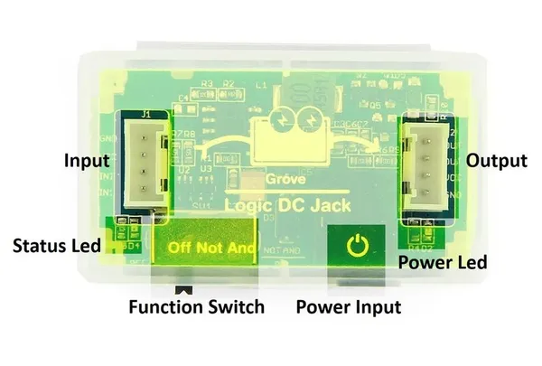

# Logic DC Jack

**Seeed Studio** · Source collection

Revision: Unverified source identity

Coverage: Source collection; review pending

[Browse all manufacturers](../../../../BROWSE.md) · [Devices & IoT](../../../../DEVICES.md) · [Open in the browser guide](https://valleytech-black-wire-guide.pages.dev/?board=source-board-982542c02b82f4ed6f)

## Datasheets and original documentation

Board datasheet: **not yet recorded**. Visual reference: **available**.

[Manufacturer source (recorded link)](https://wiki.seeedstudio.com/Logic_DC_Jack/)

A chip datasheet, schematic and board datasheet have different scopes. Match the exact hardware revision.

[Documentation coverage and remaining gaps](../../../../DOCUMENTATION.md)

## Hardware Overview

**source reference** · Unreviewed source · JPG

[Open original reference](../../../../library/media/8d183abbf0d95cbfe73d4d53b27212f1ec4baf617fd3b6cccbf2672b6262da0a.jpg)

**Credit and rights:** Source rights not yet established. Source/manufacturer: Seeed Studio.

[Source 1](https://files.seeedstudio.com/wiki/Logic_DC_Jack/img/Logic_dc_jack_hardware_overview1.JPG) · [Source 2](https://wiki.seeedstudio.com/Logic_DC_Jack/)

Original source index: Hardware Overview. This file is searchable but has not been promoted to a reviewed physical board pinout.

Image revision: Not identified

SHA-256: `8d183abbf0d95cbfe73d4d53b27212f1ec4baf617fd3b6cccbf2672b6262da0a`

Pin assignments have not been independently electrically verified. Check board revision before wiring.
