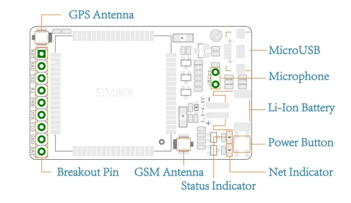
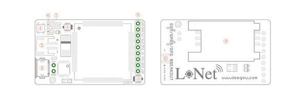

# LoNet 808 - Mini GSM-GPRS + GPS Breakout

**Seeed Studio** · Source collection

Revision: Unverified source identity  
Coverage: Source collection; review pending

[Browse all manufacturers](../../../../BROWSE.md) · [Desktop app](https://github.com/valleytechsolutions/black-wire-desktop)

## Mini GSM-GPRS + GPS Breakout - Hardware Overview

**source reference** · Unreviewed source · JPG

[Open original reference](../../../../library/media/2e2ecedde360e4033b45da7862af8367122e20c8de79227dedbc8459cf11a533.jpg)

**Credit and rights:** Source rights not yet established. Source/manufacturer: Seeed Studio.

[Source 1](https://files.seeedstudio.com/wiki/Mini-GSM-GPRS-GPS-Breakout-SIM808/img/Lonet_pcb_top.jpg) · [Source 2](https://wiki.seeedstudio.com/Mini_GSM_GPRS_GPS_Breakout_SIM808/)

Original source index: Mini GSM-GPRS + GPS Breakout - Hardware Overview. This file is searchable but has not been promoted to a reviewed physical board pinout.

SHA-256: `2e2ecedde360e4033b45da7862af8367122e20c8de79227dedbc8459cf11a533`

## Mini GSM-GPRS + GPS Breakout - Interfaces

**source reference** · Unreviewed source · PNG

[Open original reference](../../../../library/media/7c75ef59d14149d0be68bd2c6fe8f632e4c9b71e0592a6792b6b4665aacd0540.png)

**Credit and rights:** Source rights not yet established. Source/manufacturer: Seeed Studio.

[Source 1](https://files.seeedstudio.com/wiki/LoNet_808-Mini_GSM_GPRS_Plus_GPS_Breakout/img/Mappings-01.png) · [Source 2](https://wiki.seeedstudio.com/LoNet_808-Mini_GSM_GPRS_Plus_GPS_Breakout/)

Original source index: Mini GSM-GPRS + GPS Breakout - Interfaces. This file is searchable but has not been promoted to a reviewed physical board pinout.

SHA-256: `7c75ef59d14149d0be68bd2c6fe8f632e4c9b71e0592a6792b6b4665aacd0540`

Pin assignments have not been independently electrically verified. Check board revision before wiring.
