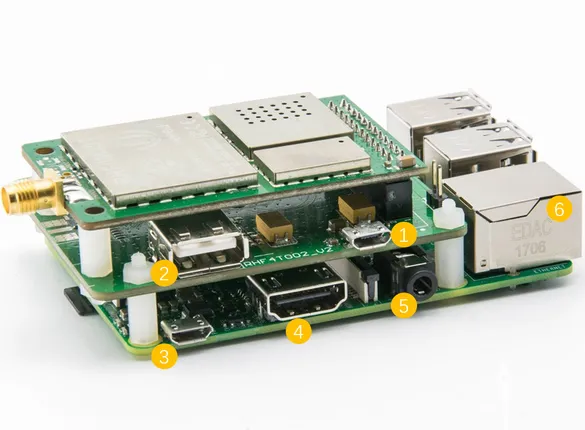

# LoRa-LoRaWAN Gateway Kit

**Seeed Studio** · Source collection

Revision: Unverified source identity  
Coverage: Source collection; review pending

[Browse all manufacturers](../../../../BROWSE.md) · [Desktop app](https://github.com/valleytechsolutions/black-wire-desktop)

## Interfaces

**source reference** · Unreviewed source · JPG

[Open original reference](../../../../library/media/d318ef7b55ebb71f7dba4cc0914d37c18d746d59f7fbfd8b0edc3058a7c27644.jpg)

**Credit and rights:** Source rights not yet established. Source/manufacturer: Seeed Studio.

[Source 1](https://files.seeedstudio.com/wiki/LoRaWAN_Gateway-868MHz_Kit_with_Raspberry_Pi_3/img/Lora_interface.jpg) · [Source 2](https://wiki.seeedstudio.com/LoRa_LoRaWan_Gateway_Kit/)

Original source index: Interfaces. This file is searchable but has not been promoted to a reviewed physical board pinout.

SHA-256: `d318ef7b55ebb71f7dba4cc0914d37c18d746d59f7fbfd8b0edc3058a7c27644`

Pin assignments have not been independently electrically verified. Check board revision before wiring.
