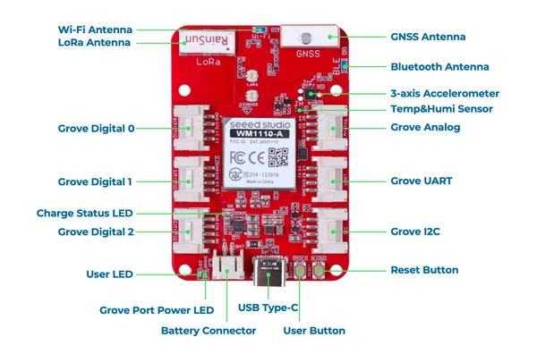

# LPWAN Dev Kit for Sidewalk

**Seeed Studio** · Source collection

Revision: Unverified source identity  
Coverage: Source collection; review pending

[Browse all manufacturers](../../../../BROWSE.md) · [Desktop app](https://github.com/valleytechsolutions/black-wire-desktop)

## Hardware Overview

**source reference** · Unreviewed source · PNG

[Open original reference](../../../../library/media/bfc916708dca1660b90a90ca12e4316d2524bd8187bbc2ce1857cfa0a18c4004.png)

**Credit and rights:** Source rights not yet established. Source/manufacturer: Seeed Studio.

[Source 1](https://wdcdn.qpic.cn/MTY4ODg1NTkyNTI4NTEwNA_19830_N9NXJqFu1LJ_Rku__1700122819?w=1608&h=1060&type=image/png) · [Source 2](https://wiki.seeedstudio.com/wio_tracker_for_sidewalk/)

Original source index: Hardware Overview. This file is searchable but has not been promoted to a reviewed physical board pinout.

SHA-256: `bfc916708dca1660b90a90ca12e4316d2524bd8187bbc2ce1857cfa0a18c4004`

Pin assignments have not been independently electrically verified. Check board revision before wiring.
