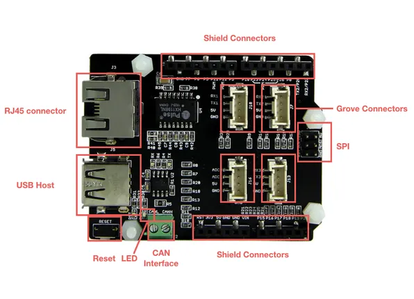

# Mbed Shield

**Seeed Studio** · Source collection

Revision: Unverified source identity  
Coverage: Source collection; review pending

[Browse all manufacturers](../../../../BROWSE.md) · [Desktop app](https://github.com/valleytechsolutions/black-wire-desktop)

## Hardware Overview

**source reference** · Unreviewed source · PNG

[Open original reference](../../../../library/media/361b104ebb5070765b744487f56a584b13f73041ee5823356fd879fd594a0c6c.png)

**Credit and rights:** Source rights not yet established. Source/manufacturer: Seeed Studio.

[Source 1](https://files.seeedstudio.com/wiki/mbed_Shield/img/mBed_Shield_Hardware_Overview.jpg) · [Source 2](https://wiki.seeedstudio.com/mbed_Shield/)

Original source index: Hardware Overview. This file is searchable but has not been promoted to a reviewed physical board pinout.

SHA-256: `361b104ebb5070765b744487f56a584b13f73041ee5823356fd879fd594a0c6c`

Pin assignments have not been independently electrically verified. Check board revision before wiring.
