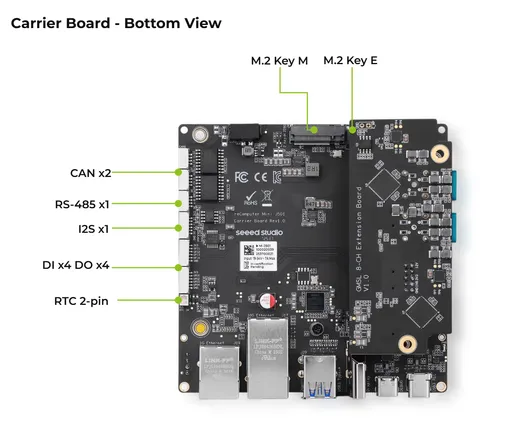
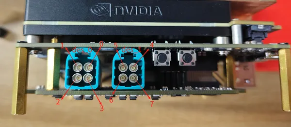
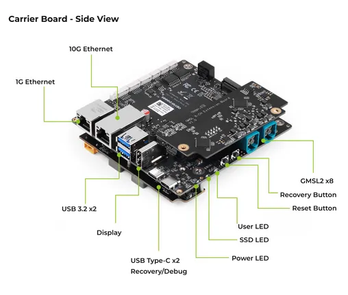
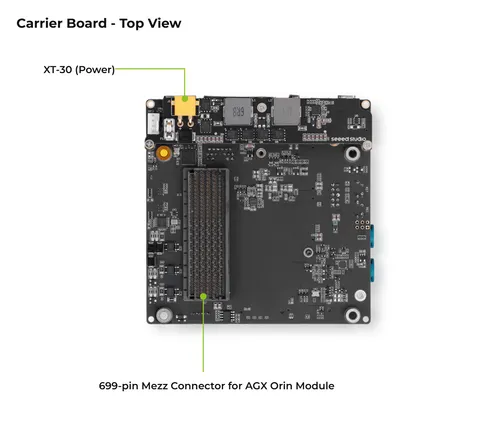

# Mini J501 Carrier Board

**Seeed Studio** · Source collection

Revision: Unverified source identity  
Coverage: Source collection; review pending

[Browse all manufacturers](../../../../BROWSE.md) · [Desktop app](https://github.com/valleytechsolutions/black-wire-desktop)

## Hardware Overview (Bottom)

**source reference** · Unreviewed source · PNG

[Open original reference](../../../../library/media/c7880f6b7f72796f6fec33aa3097d63c47a0c7f753b0747fba0fab5fdeb5f594.png)

**Credit and rights:** Source rights not yet established. Source/manufacturer: Seeed Studio.

[Source 1](https://files.seeedstudio.com/wiki/recomputer-j501-mini/bottom.png) · [Source 2](https://wiki.seeedstudio.com/recomputer_j501_mini_getting_started/)

Original source index: Hardware Overview (Bottom). This file is searchable but has not been promoted to a reviewed physical board pinout.

SHA-256: `c7880f6b7f72796f6fec33aa3097d63c47a0c7f753b0747fba0fab5fdeb5f594`

## Hardware Overview (Ports)

**source reference** · Unreviewed source · PNG

[Open original reference](../../../../library/media/82909e71baf9d55faf5eedd6da75714267a367f0ca05c9cfb2ad9cfa5e0ee81d.png)

**Credit and rights:** Source rights not yet established. Source/manufacturer: Seeed Studio.

[Source 1](https://files.seeedstudio.com/wiki/recomputer-j501-mini/gmsl-Interface.png) · [Source 2](https://wiki.seeedstudio.com/recomputer_j501_mini_getting_started/)

Original source index: Hardware Overview (Ports). This file is searchable but has not been promoted to a reviewed physical board pinout.

SHA-256: `82909e71baf9d55faf5eedd6da75714267a367f0ca05c9cfb2ad9cfa5e0ee81d`

## Hardware Overview (Side)

**source reference** · Unreviewed source · PNG

[Open original reference](../../../../library/media/bdf79bde446bd891c58d11d34734f2891585b225c4a23e9b28f3b86a974450b2.png)

**Credit and rights:** Source rights not yet established. Source/manufacturer: Seeed Studio.

[Source 1](https://files.seeedstudio.com/wiki/recomputer-j501-mini/side.png) · [Source 2](https://wiki.seeedstudio.com/recomputer_j501_mini_getting_started/)

Original source index: Hardware Overview (Side). This file is searchable but has not been promoted to a reviewed physical board pinout.

SHA-256: `bdf79bde446bd891c58d11d34734f2891585b225c4a23e9b28f3b86a974450b2`

## Hardware Overview (Top)

**source reference** · Unreviewed source · PNG

[Open original reference](../../../../library/media/742b909bcfea849c638d17f2150820d66c59e3ff1b60d846cd15cb695bf1938b.png)

**Credit and rights:** Source rights not yet established. Source/manufacturer: Seeed Studio.

[Source 1](https://files.seeedstudio.com/wiki/recomputer-j501-mini/top.png) · [Source 2](https://wiki.seeedstudio.com/recomputer_j501_mini_getting_started/)

Original source index: Hardware Overview (Top). This file is searchable but has not been promoted to a reviewed physical board pinout.

SHA-256: `742b909bcfea849c638d17f2150820d66c59e3ff1b60d846cd15cb695bf1938b`

Pin assignments have not been independently electrically verified. Check board revision before wiring.
