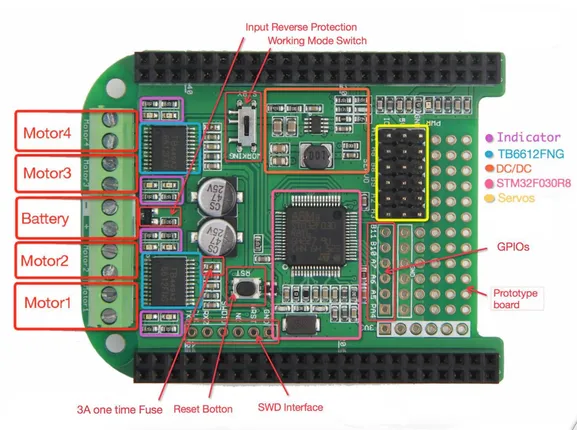

# Motor Bridge Cape V1.0

**Seeed Studio** · Source collection

Revision: Unverified source identity  
Coverage: Source collection; review pending

[Browse all manufacturers](../../../../BROWSE.md) · [Desktop app](https://github.com/valleytechsolutions/black-wire-desktop)

## Hardware Overview

**source reference** · Unreviewed source · JPG

[Open original reference](../../../../library/media/dcbbb2cd00c43dd9797f0d4003f9a827c0d419b40650dbfcb3b12d659921babf.jpg)

**Credit and rights:** Source rights not yet established. Source/manufacturer: Seeed Studio.

Original source index: Hardware Overview. This file is searchable but has not been promoted to a reviewed physical board pinout.

SHA-256: `dcbbb2cd00c43dd9797f0d4003f9a827c0d419b40650dbfcb3b12d659921babf`

Pin assignments have not been independently electrically verified. Check board revision before wiring.
