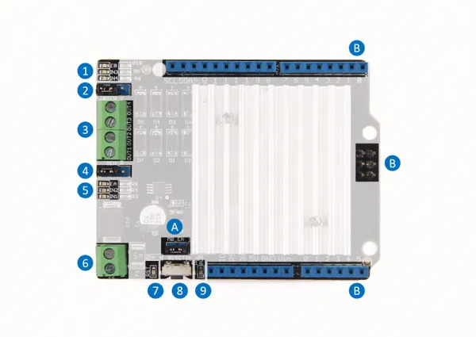

# Motor Shield V2.0

**Seeed Studio** · Source collection

Revision: Unverified source identity  
Coverage: Source collection; review pending

[Browse all manufacturers](../../../../BROWSE.md) · [Desktop app](https://github.com/valleytechsolutions/black-wire-desktop)

## Hardware Overview

**source reference** · Unreviewed source · PNG

[Open original reference](../../../../library/media/3fc04e7a3eea2acbeee8bbb1001fccc662d5ee3f278cf37dcb5dbc415ccfdb38.png)

**Credit and rights:** Source rights not yet established. Source/manufacturer: Seeed Studio.

[Source 1](https://files.seeedstudio.com/wiki/Motor_Shield_V2.0/image/700px-MotorShieldHardware.png) · [Source 2](https://wiki.seeedstudio.com/Motor_Shield_V2.0/)

Original source index: Hardware Overview. This file is searchable but has not been promoted to a reviewed physical board pinout.

SHA-256: `3fc04e7a3eea2acbeee8bbb1001fccc662d5ee3f278cf37dcb5dbc415ccfdb38`

Pin assignments have not been independently electrically verified. Check board revision before wiring.
