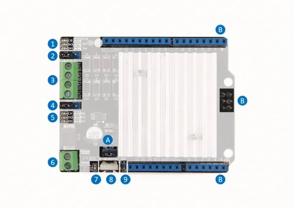

# Motor Shield V2.0

**Seeed Studio** · Source collection

Revision: Unverified source identity

Coverage: Source collection; review pending

[Browse all manufacturers](../../../../BROWSE.md) · [Devices & IoT](../../../../DEVICES.md) · [Open in the browser guide](https://valleytech-black-wire-guide.pages.dev/?board=source-board-e74acb5fa3062d1a14)

## Datasheets and original documentation

Board datasheet: **not yet recorded**. Visual reference: **available**.

[Manufacturer source (recorded link)](https://wiki.seeedstudio.com/Motor_Shield_V2.0/)

A chip datasheet, schematic and board datasheet have different scopes. Match the exact hardware revision.

[Documentation coverage and remaining gaps](../../../../DOCUMENTATION.md)

## Hardware Overview

**source reference** · Unreviewed source · PNG

[Open original reference](../../../../library/media/3fc04e7a3eea2acbeee8bbb1001fccc662d5ee3f278cf37dcb5dbc415ccfdb38.png)

**Credit and rights:** Source rights not yet established. Source/manufacturer: Seeed Studio.

[Source 1](https://files.seeedstudio.com/wiki/Motor_Shield_V2.0/image/700px-MotorShieldHardware.png) · [Source 2](https://wiki.seeedstudio.com/Motor_Shield_V2.0/)

Original source index: Hardware Overview. This file is searchable but has not been promoted to a reviewed physical board pinout.

Image revision: Not identified

SHA-256: `3fc04e7a3eea2acbeee8bbb1001fccc662d5ee3f278cf37dcb5dbc415ccfdb38`

Pin assignments have not been independently electrically verified. Check board revision before wiring.
