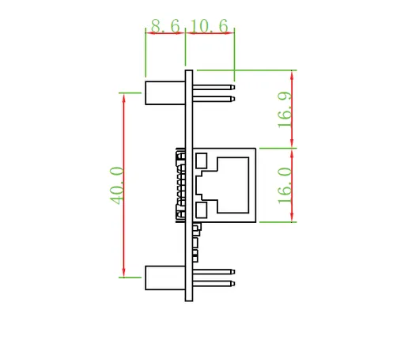
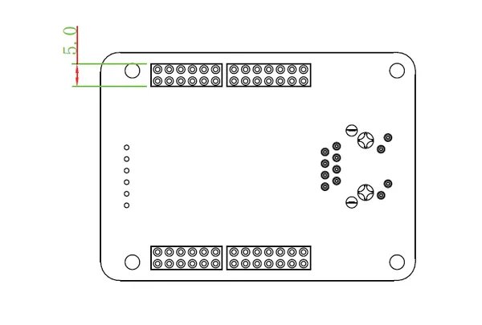
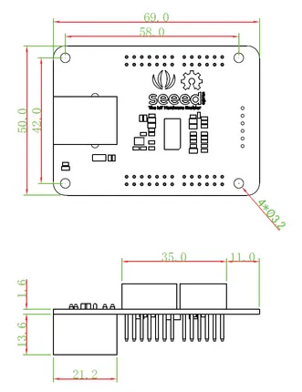
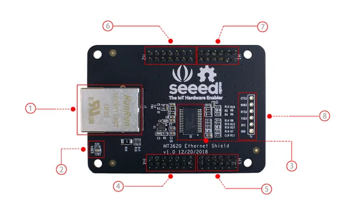
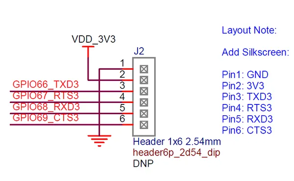
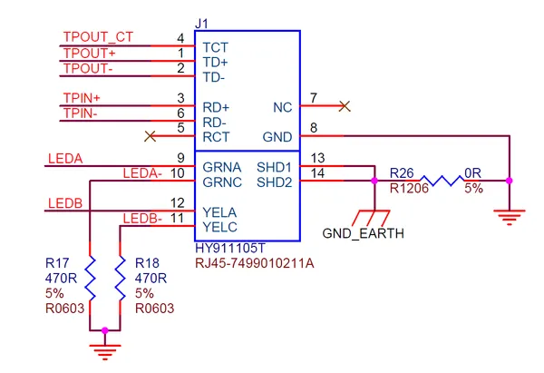

# MT3620 Ethernet Shield V1.0

**Seeed Studio** · Source collection

Revision: Unverified source identity  
Coverage: Source collection; review pending

[Browse all manufacturers](../../../../BROWSE.md) · [Desktop app](https://github.com/valleytechsolutions/black-wire-desktop)

## Dimensions 2

**source reference** · Unreviewed source · PNG

[Open original reference](../../../../library/media/5d8eba589ca6db84077d1785bb4fb7a37415332f35f41136d580656b29883d89.png)

**Credit and rights:** Source rights not yet established. Source/manufacturer: Seeed Studio.

[Source 1](https://files.seeedstudio.com/wiki/MT3620_Ethernet_Shield_v1.0/img/drawing2.png) · [Source 2](https://wiki.seeedstudio.com/MT3620_Ethernet_Shield_v1.0/)

Original source index: Dimensions 2. This file is searchable but has not been promoted to a reviewed physical board pinout.

SHA-256: `5d8eba589ca6db84077d1785bb4fb7a37415332f35f41136d580656b29883d89`

## Dimensions 3

**source reference** · Unreviewed source · PNG

[Open original reference](../../../../library/media/34e22ae25f2e0e5ac664f0146cc99c1abc031151aa4dbf0f1a29feaaf8047473.png)

**Credit and rights:** Source rights not yet established. Source/manufacturer: Seeed Studio.

[Source 1](https://files.seeedstudio.com/wiki/MT3620_Ethernet_Shield_v1.0/img/drawing3.png) · [Source 2](https://wiki.seeedstudio.com/MT3620_Ethernet_Shield_v1.0/)

Original source index: Dimensions 3. This file is searchable but has not been promoted to a reviewed physical board pinout.

SHA-256: `34e22ae25f2e0e5ac664f0146cc99c1abc031151aa4dbf0f1a29feaaf8047473`

## Dimensions

**source reference** · Unreviewed source · PNG

[Open original reference](../../../../library/media/a68e2384ef47f8e14ee3c31e9dad600bb6c0cb31d7d3ab4d569a3c33554b949d.png)

**Credit and rights:** Source rights not yet established. Source/manufacturer: Seeed Studio.

[Source 1](https://files.seeedstudio.com/wiki/MT3620_Ethernet_Shield_v1.0/img/drawing1.png) · [Source 2](https://wiki.seeedstudio.com/MT3620_Ethernet_Shield_v1.0/)

Original source index: Dimensions. This file is searchable but has not been promoted to a reviewed physical board pinout.

SHA-256: `a68e2384ef47f8e14ee3c31e9dad600bb6c0cb31d7d3ab4d569a3c33554b949d`

## Hardware Overview

**source reference** · Unreviewed source · PNG

[Open original reference](../../../../library/media/debecd8c223ed73faf68f62fa9d6f5fc32d86ba221db3b64613410a6d5a0fac2.png)

**Credit and rights:** Source rights not yet established. Source/manufacturer: Seeed Studio.

[Source 1](https://files.seeedstudio.com/wiki/MT3620_Ethernet_Shield_v1.0/img/hardware_overview.png) · [Source 2](https://wiki.seeedstudio.com/MT3620_Ethernet_Shield_v1.0/)

Original source index: Hardware Overview. This file is searchable but has not been promoted to a reviewed physical board pinout.

SHA-256: `debecd8c223ed73faf68f62fa9d6f5fc32d86ba221db3b64613410a6d5a0fac2`

## Pin Definition (J2 UART Header)

**source reference** · Unreviewed source · PNG

[Open original reference](../../../../library/media/011cb75d8989dc55773a48e636fdc375dbf8b45b5899ff04655f6c4996be6377.png)

**Credit and rights:** Source rights not yet established. Source/manufacturer: Seeed Studio.

[Source 1](https://files.seeedstudio.com/wiki/MT3620_Ethernet_Shield_v1.0/img/J2.png) · [Source 2](https://wiki.seeedstudio.com/MT3620_Ethernet_Shield_v1.0/)

Original source index: Pin Definition (J2 UART Header). This file is searchable but has not been promoted to a reviewed physical board pinout.

SHA-256: `011cb75d8989dc55773a48e636fdc375dbf8b45b5899ff04655f6c4996be6377`

## Pin Definition (RJ45 Connector J1)

**source reference** · Unreviewed source · PNG

[Open original reference](../../../../library/media/dacbd60b6fcde9111b98ae40d98914e2ed6e38831875cfc51c507cca19e5ef18.png)

**Credit and rights:** Source rights not yet established. Source/manufacturer: Seeed Studio.

[Source 1](https://files.seeedstudio.com/wiki/MT3620_Ethernet_Shield_v1.0/img/J1.png) · [Source 2](https://wiki.seeedstudio.com/MT3620_Ethernet_Shield_v1.0/)

Original source index: Pin Definition (RJ45 Connector J1). This file is searchable but has not been promoted to a reviewed physical board pinout.

SHA-256: `dacbd60b6fcde9111b98ae40d98914e2ed6e38831875cfc51c507cca19e5ef18`

Pin assignments have not been independently electrically verified. Check board revision before wiring.
