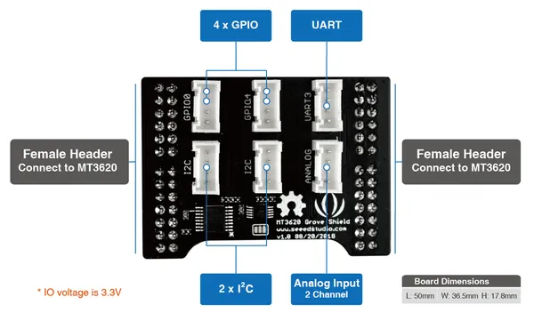

# MT3620 Grove Shield

**Seeed Studio** · Source collection

Revision: Unverified source identity  
Coverage: Source collection; review pending

[Browse all manufacturers](../../../../BROWSE.md) · [Desktop app](https://github.com/valleytechsolutions/black-wire-desktop)

## Hardware Overview

**source reference** · Unreviewed source · PNG

[Open original reference](../../../../library/media/1dbc3f22e7f7796f08ff8c9b365ac37c516bd9f6d9859a952cf6a97625c650df.png)

**Credit and rights:** Source rights not yet established. Source/manufacturer: Seeed Studio.

[Source 1](https://files.seeedstudio.com/wiki/Azure_Sphere_MT3620_Development_Kit/img/MT3620_Grove_Shield-2018-09-11.png) · [Source 2](https://wiki.seeedstudio.com/Grove_Starter_Kit_for_Azure_Sphere_MT3620_Development_Kit/)

Original source index: Hardware Overview. This file is searchable but has not been promoted to a reviewed physical board pinout.

SHA-256: `1dbc3f22e7f7796f08ff8c9b365ac37c516bd9f6d9859a952cf6a97625c650df`

Pin assignments have not been independently electrically verified. Check board revision before wiring.
