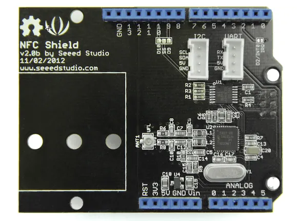
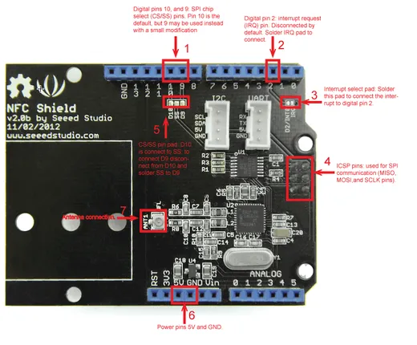

# NFC Shield V2.0

**Seeed Studio** · Source collection

Revision: Unverified source identity  
Coverage: Source collection; review pending

[Browse all manufacturers](../../../../BROWSE.md) · [Desktop app](https://github.com/valleytechsolutions/black-wire-desktop)

## Hardware Overview (Front)

**source reference** · Unreviewed source · PNG

[Open original reference](../../../../library/media/35707d55e073a9231ef62fd514de60cb73d4685be6de3aeb97bf96b0f1ac4cfb.png)

**Credit and rights:** Source rights not yet established. Source/manufacturer: Seeed Studio.

[Source 1](https://files.seeedstudio.com/wiki/NFC_Shield_V2.0/img/NFC_front.png) · [Source 2](https://wiki.seeedstudio.com/NFC_Shield_V2.0/)

Original source index: Hardware Overview (Front). This file is searchable but has not been promoted to a reviewed physical board pinout.

SHA-256: `35707d55e073a9231ef62fd514de60cb73d4685be6de3aeb97bf96b0f1ac4cfb`

## Pin Functions

**source reference** · Unreviewed source · PNG

[Open original reference](../../../../library/media/389a21942795bc5a4b03dbbca6175e07d3d0e66abdec4b4d5f86ff99c60b00a7.png)

**Credit and rights:** Source rights not yet established. Source/manufacturer: Seeed Studio.

[Source 1](https://files.seeedstudio.com/wiki/NFC_Shield_V2.0/img/Pn532-nfc-shield-pin-description.png) · [Source 2](https://wiki.seeedstudio.com/NFC_Shield_V2.0/)

Original source index: Pin Functions. This file is searchable but has not been promoted to a reviewed physical board pinout.

SHA-256: `389a21942795bc5a4b03dbbca6175e07d3d0e66abdec4b4d5f86ff99c60b00a7`

Pin assignments have not been independently electrically verified. Check board revision before wiring.
