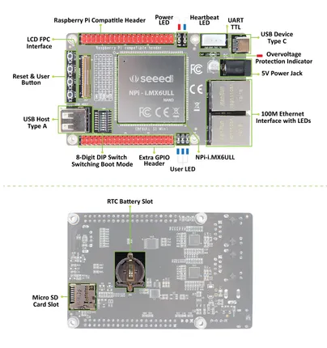
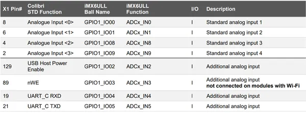
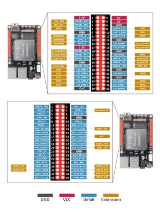

# NPi i.MX6ULL Dev Board

**Seeed Studio** · Source collection

Revision: Unverified source identity  
Coverage: Source collection; review pending

[Browse all manufacturers](../../../../BROWSE.md) · [Desktop app](https://github.com/valleytechsolutions/black-wire-desktop)

## Hardware Overview

**source reference** · Unreviewed source · JPG

[Open original reference](../../../../library/media/6acf55ddd68e96eda7ed167e41614abdea6c9f99926f50da4d84644850166b24.jpg)

**Credit and rights:** Source rights not yet established. Source/manufacturer: Seeed Studio.

[Source 1](https://files.seeedstudio.com/wiki/NPi-i-MX6ULL-Dev-Board/IMG/NAND-over.jpg) · [Source 2](https://wiki.seeedstudio.com/NPi-i.MX6ULL-Dev-Board-Linux-SBC/)

Original source index: Hardware Overview. This file is searchable but has not been promoted to a reviewed physical board pinout.

SHA-256: `6acf55ddd68e96eda7ed167e41614abdea6c9f99926f50da4d84644850166b24`

## Pin Definition Table (ADC)

**source reference** · Unreviewed source · PNG

[Open original reference](../../../../library/media/e459263ca210536196b59125a04f039f5f7dad84aeb70d843da76034ef6e1e8b.png)

**Credit and rights:** Source rights not yet established. Source/manufacturer: Seeed Studio.

[Source 1](https://files.seeedstudio.com/wiki/NPi-i-MX6ULL-Dev-Board/IMG/adc-pin-map.png) · [Source 2](https://wiki.seeedstudio.com/NPi-i.MX6ULL-Dev-Board-Linux-SBC/)

Original source index: Pin Definition Table (ADC). This file is searchable but has not been promoted to a reviewed physical board pinout.

SHA-256: `e459263ca210536196b59125a04f039f5f7dad84aeb70d843da76034ef6e1e8b`

## Pin Definition Table

**source reference** · Unreviewed source · JPG

[Open original reference](../../../../library/media/4b0dc5a05313cf2dfb62b63c16bcdd4f90a1512c2f5a1d1af555dc4e07b111f1.jpg)

**Credit and rights:** Source rights not yet established. Source/manufacturer: Seeed Studio.

[Source 1](https://files.seeedstudio.com/wiki/NPi-i-MX6ULL-Dev-Board/IMG/eMMC-c.jpg) · [Source 2](https://wiki.seeedstudio.com/NPi-i.MX6ULL-Dev-Board-Linux-SBC/)

Original source index: Pin Definition Table. This file is searchable but has not been promoted to a reviewed physical board pinout.

SHA-256: `4b0dc5a05313cf2dfb62b63c16bcdd4f90a1512c2f5a1d1af555dc4e07b111f1`

Pin assignments have not been independently electrically verified. Check board revision before wiring.
