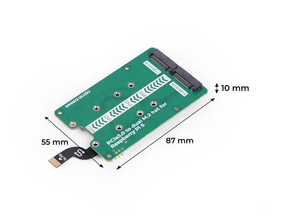

# PCIe 3.0 to Dual M.2 HAT for Raspberry Pi 5

**Seeed Studio** · Source collection

Revision: Unverified source identity  
Coverage: Source collection; review pending

[Browse all manufacturers](../../../../BROWSE.md) · [Desktop app](https://github.com/valleytechsolutions/black-wire-desktop)

## Dimensions

**source reference** · Unreviewed source · JPG

[Open original reference](../../../../library/media/16680416052712b51f8503267170dc7948828ed6a682f88b797237ac665a9384.jpg)

**Credit and rights:** Source rights not yet established. Source/manufacturer: Seeed Studio.

[Source 1](https://media-cdn.seeedstudio.com/media/catalog/product/8/-/8-103110065-pcie3.0_to_dual_m.2_hat_for_raspberry_pi-5-size.jpg) · [Source 2](https://www.seeedstudio.com/PCIe3-0-to-dual-M-2-hat-for-Raspberry-Pi-5-p-6358.html)

Original source index: Dimensions. This file is searchable but has not been promoted to a reviewed physical board pinout.

SHA-256: `16680416052712b51f8503267170dc7948828ed6a682f88b797237ac665a9384`

Pin assignments have not been independently electrically verified. Check board revision before wiring.
