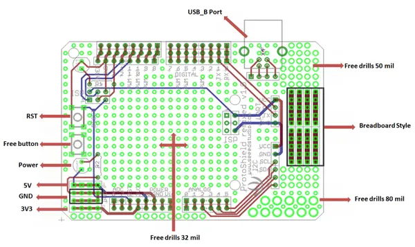

# Protoshield Kit for Arduino

**Seeed Studio** · Source collection

Revision: Unverified source identity  
Coverage: Source collection; review pending

[Browse all manufacturers](../../../../BROWSE.md) · [Desktop app](https://github.com/valleytechsolutions/black-wire-desktop)

## Hardware Overview

**source reference** · Unreviewed source · PNG

[Open original reference](../../../../library/media/4e13969d73c5ca0a7a54ca337a2b09efae6a7be94806386674c8ab50bfbf0236.png)

**Credit and rights:** Source rights not yet established. Source/manufacturer: Seeed Studio.

[Source 1](https://files.seeedstudio.com/wiki/Protoshield_Kit_for_Arduino/img/ProtoShield_Kit.png) · [Source 2](https://wiki.seeedstudio.com/Protoshield_Kit_for_Arduino/)

Original source index: Hardware Overview. This file is searchable but has not been promoted to a reviewed physical board pinout.

SHA-256: `4e13969d73c5ca0a7a54ca337a2b09efae6a7be94806386674c8ab50bfbf0236`

Pin assignments have not been independently electrically verified. Check board revision before wiring.
