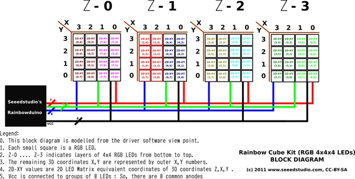
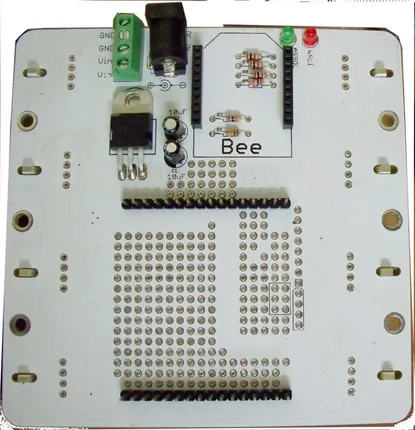

# Rainbow Cube Kit - RGB 4x4x4

**Seeed Studio** · Source collection

Revision: Unverified source identity  
Coverage: Source collection; review pending

[Browse all manufacturers](../../../../BROWSE.md) · [Desktop app](https://github.com/valleytechsolutions/black-wire-desktop)

## RGB 4x4x4 - Block Diagram

**source reference** · Unreviewed source · PNG

[Open original reference](../../../../library/media/8f6b41397ab145b1abc23e01319d58d5d2886fa09661c4c3f056ffbe74d940c8.png)

**Credit and rights:** Source rights not yet established. Source/manufacturer: Seeed Studio.

[Source 1](https://files.seeedstudio.com/wiki/Rainbow_Cube_kit_RGB_4_4_4_Rainbowduino_Compatible/img/Rainbow_Cube_kit_Block_Diagram.png) · [Source 2](https://wiki.seeedstudio.com/Rainbow_Cube_kit_RGB_4_4_4_Rainbowduino_Compatible/)

Original source index: RGB 4x4x4 - Block Diagram. This file is searchable but has not been promoted to a reviewed physical board pinout.

SHA-256: `8f6b41397ab145b1abc23e01319d58d5d2886fa09661c4c3f056ffbe74d940c8`

## RGB 4x4x4 - Hardware Overview (Bottom)

**source reference** · Unreviewed source · JPG

[Open original reference](../../../../library/media/f46c169a9daab9a02c4516fa84bcba60cd968830b6409db0df705eb0dc002bdc.jpg)

**Credit and rights:** Source rights not yet established. Source/manufacturer: Seeed Studio.

[Source 1](https://files.seeedstudio.com/wiki/Rainbow_Cube_kit_RGB_4_4_4_Rainbowduino_Compatible/img/Rainbow_Cube_Panel_Bottom.jpg) · [Source 2](https://wiki.seeedstudio.com/Rainbow_Cube_kit_RGB_4_4_4_Rainbowduino_Compatible/)

Original source index: RGB 4x4x4 - Hardware Overview (Bottom). This file is searchable but has not been promoted to a reviewed physical board pinout.

SHA-256: `f46c169a9daab9a02c4516fa84bcba60cd968830b6409db0df705eb0dc002bdc`

Pin assignments have not been independently electrically verified. Check board revision before wiring.
