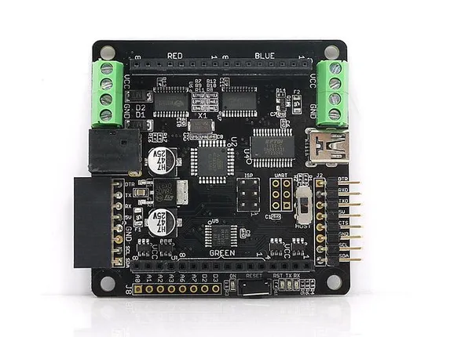
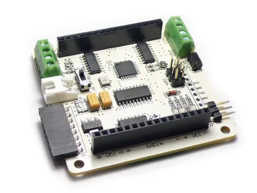

# Rainbowduino

**Seeed Studio** · Source collection

Revision: Unverified source identity  
Coverage: Source collection; review pending

[Browse all manufacturers](../../../../BROWSE.md) · [Desktop app](https://github.com/valleytechsolutions/black-wire-desktop)

## Hardware Overview (V3.0)

**source reference** · Unreviewed source · JPG

[Open original reference](../../../../library/media/6d4e067e1bf6b4fa63a0daaecf9cfd9a40133935f777c246011985219bcb581a.jpg)

**Credit and rights:** Source rights not yet established. Source/manufacturer: Seeed Studio.

[Source 1](https://files.seeedstudio.com/wiki/Rainbowduino/img/Rainbowduino_V3.0.jpg) · [Source 2](https://wiki.seeedstudio.com/Rainbowduino/)

Original source index: Hardware Overview (V3.0). This file is searchable but has not been promoted to a reviewed physical board pinout.

SHA-256: `6d4e067e1bf6b4fa63a0daaecf9cfd9a40133935f777c246011985219bcb581a`

## Hardware Overview

**source reference** · Unreviewed source · JPG

[Open original reference](../../../../library/media/8e56731324f0cb9cd231441bfb4ef0c8feaf9cf4ae02d328e040e2b157f8bdf6.jpg)

**Credit and rights:** Source rights not yet established. Source/manufacturer: Seeed Studio.

[Source 1](https://files.seeedstudio.com/wiki/Rainbowduino/img/RAINBOW-Rainbowduino_LRG.jpg) · [Source 2](https://wiki.seeedstudio.com/Rainbowduino/)

Original source index: Hardware Overview. This file is searchable but has not been promoted to a reviewed physical board pinout.

SHA-256: `8e56731324f0cb9cd231441bfb4ef0c8feaf9cf4ae02d328e040e2b157f8bdf6`

Pin assignments have not been independently electrically verified. Check board revision before wiring.
