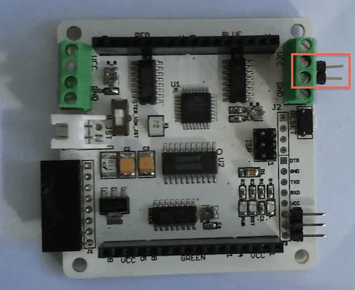

# Rainbowduino LED Driver Platform - ATmega328

**Seeed Studio** · Source collection

Revision: Unverified source identity  
Coverage: Source collection; review pending

[Browse all manufacturers](../../../../BROWSE.md) · [Desktop app](https://github.com/valleytechsolutions/black-wire-desktop)

## ATmega328 - Hardware Overview

**source reference** · Unreviewed source · PNG

[Open original reference](../../../../library/media/038b5550bcff9f2d0d9a5bb77a9092f17a9b147dc2e55fc508b585606fd1b9be.png)

**Credit and rights:** Source rights not yet established. Source/manufacturer: Seeed Studio.

[Source 1](https://files.seeedstudio.com/wiki/Rainbowduino_LED_driver_platform-ATmega328/img/RAINBOW-chain-prepare.png) · [Source 2](https://wiki.seeedstudio.com/Rainbowduino_LED_driver_platform-ATmega328/)

Original source index: ATmega328 - Hardware Overview. This file is searchable but has not been promoted to a reviewed physical board pinout.

SHA-256: `038b5550bcff9f2d0d9a5bb77a9092f17a9b147dc2e55fc508b585606fd1b9be`

Pin assignments have not been independently electrically verified. Check board revision before wiring.
